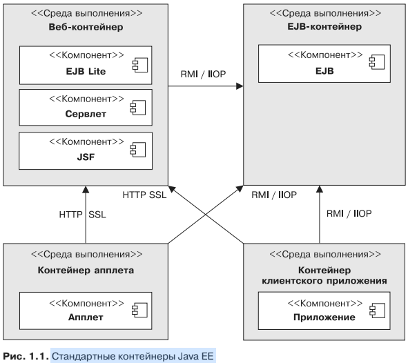

# Jakarta EE

## Стандартные контейнеры Java EE

## Контейнеры

* Контейнеры апплетов выполняются большинством браузеров. При разработке 
апплетов можно сконцентрироваться на визуальной стороне приложения, в то 
время как контейнер обеспечивает безопасную среду. Контейнер апплета ис-
пользует модель безопасности изолированной программной среды («песочни-цы»), 
где коду, выполняемому в «песочнице», не разрешается «играть» за еепределами. 
Это означает, что контейнер препятствует любому коду, загружен-
ному на ваш локальный компьютер, получать доступ к локальным ресурсам
системы (процессам либо файлам).

* Контейнер клиентского приложения (ACC) включает набор Java-классов, би-
блиотек и других файлов, необходимых для реализации в приложениях Java SE
таких возможностей, как внедрение, управление безопасностью и служба имено-
вания (в частности, Swing, пакетная обработка либо просто класс сметодом main()).
Контейнер ACC обращается к EJB-контейнеру, используя протокол RMI-IIOP,
а к веб-контейнеру — по протоколу HTTP (например, для веб-служб).

* Веб-контейнер предоставляет базовые службы для управления и исполнения веб-
компонентов (сервлетов, компонентов EJB Lite, страниц JSP, фильтров, слушате-
лей, страниц JSF и веб-служб). Он отвечает за создание экземпляров, инициали-
зацию и вызов сервлетов, а также поддержку протоколов HTTP и HTTPS. Этот
контейнер используется для подачи веб-страниц к клиент-браузерам.

* EJB-контейнер отвечает за управление и исполнение компонентов модели EJB  
(компонент-сеансы EJB и компоненты, управляемые сообщениями), содержа-
щих уровень бизнес-логики вашего приложения на Java EE. Он создает новые
сущности компонентов EJB, управляет их жизненным циклом и обеспечивает
реализацию таких сервисов, как транзакция, безопасность, параллельный доступ,
распределение, служба именования либо возможность асинхронного вызова.

## Сервисы

* Java API для транзакций — этот сервис предлагает интерфейс разграничения
транзакций, используемый контейнером и приложением. Он также предоставляет 
интерфейс между диспетчером транзакций и диспетчером ресурсов на
уровне интерфейса драйвера службы.

* Интерфейс сохраняемости Java — стандартный интерфейс для объектно-реляционного
отображения (ORM). С помощью встроенного языка запросов
JPQL вы можете обращаться к объектам, хранящимся в основной базе данных.

* Валидация — благодаря валидации компонентов объявляется ограничение це-
лостности на уровне класса и метода.

* Интерфейс Java для доступа к службам сообщений — позволяет компонентам
асинхронно обмениваться данными через сообщения. Он поддерживает надеж-
ный обмен сообщениями по принципу «от точки к точке» (P2P), а также модель
публикации-подписки (pub-sub).

* Java-интерфейс каталогов и служб именования (JNDI) — этот интерфейс, по-
явившийся в Java SE, используется как раз для доступа к системам служб 
именования и каталогов. Ваше приложение применяет его, чтобы ассоцииро-
вать (связывать) имена с объектами и затем находить их в каталогах. Вы мо-
жете задать поиск источников данных, фабрик классов JMS, компонентов EJB
и других ресурсов. Интерфейс JNDI, повсеместно присутствовавший в коде
до версии 1.4 J2EE, в настоящее время используется более прозрачным спо-
собом — через внедрение.

* Интерфейс JavaMail — многим приложениям требуется функция отправки со-
общений электронной почты, которая может быть реализована благодаря этому
интерфейсу.

* Фреймворк активизации компонентов JavaBeans (JAF) — интерфейс JAF, яв-
ляющийся составной частью платформы Java SE, предоставляет фреймворк для
обработки данных различных MIME-типов. Используется сервисом JavaMail.

* Обработка XML — большинство компонентов Java EE могут развертываться
с помощью опциональных дескрипторов развертывания XML, а приложениям
часто приходится манипулировать XML-документами. Интерфейс Java для
обработки XML (JAXP) поддерживает синтаксический анализ документов
с применением интерфейсов SAX и DOM, а также на языке XSLT.

* Обработка JSON (объектной нотации JavaScript) — появившийся только в Java
EE 7 Java-интерфейс для обработки JSON (JSON-P) позволяет приложениям
синтаксически анализировать, генерировать, трансформировать и запрашивать
JSON.

* Архитектура коннектора Java EE — коннекторы позволяют получить доступ
к корпоративным информационным системам (EIS) с компонента Java EE.
К таким компонентам относятся базы данных, мейнфреймы либо программы
для планирования и управления ресурсами предприятия (ERP).

* Службы безопасности — служба аутентификации и авторизации для платформы
Java (JAAS) позволяет сервисам аутентифицироваться и устанавливать права
доступа, обязательные для пользователей. Контракт поставщика сервиса авто-
ризации Java для контейнеров (JACC) определяет соглашение о взаимодействии 
между сервером приложений Java EE и поставщиком сервиса авторизации, по-
зволяя, таким образом, сторонним поставщикам такого сервиса подключаться
к любому продукту Java EE. Интерфейс поставщика сервисов аутентификации
Java для контейнеров (JASPIC) определяет стандартный интерфейс, с помощью
которого модули аутентификации могут быть интегрированы с контейнерами.
В результате модули могут установить идентификаторы подлинности, исполь-
зуемые контейнерами.

* Веб-службы — Java EE поддерживает веб-службы SOAP и RESTful. Интерфейс
Java для веб-служб на XML (JAX-WS), сменивший интерфейс Java с поддерж-
кой вызовов удаленных процедур на основе XML (JAX-RPC), обеспечивает
работу веб-служб, работающих по протоколу SOAP/HTTP. Интерфейс Java для
веб-служб RESTful (JAX-RS) поддерживает веб-службы, использующие стиль
REST.

* Внедрение зависимостей — начиная с Java EE 5, некоторые ресурсы могут
внедряться в управляемые компоненты. К таким ресурсам относятся источ-
ники данных, фабрики классов JMS, единицы сохраняемости, компоненты
EJB и т. д. Кроме того, для этих целей Java EE 7 использует спецификации по
контексту и внедрению зависимости (CDI), а также внедрение зависимости
для Java (DI).

* Управление — Java EE с помощью специального управляющего компонента
определяет API для операций с контейнерами и серверами. Интерфейс управ-
ляющих расширений Java (JMXAPI) также используется для поддержки управ-
ления.

* Развертывание — спецификация Java EE по развертыванию определяет согла-
шение о взаимодействии между средствами развертывания и продуктами Java
EE для стандартизации развертывания приложения.

[Сетевые протоколы](mds/network_protocols.md)

[Упаковка](mds/packaging.md)

[Дескриптор развертывания](mds/deployment_descriptors.md)

[Java EE 7 спецификации](mds/java_ee7_specifications.md)

#### CDI
[@Inject](mds/cdi/inject.md)

[Scope](mds/cdi/scope.md)

[Interceptor](mds/cdi/interceptors.md)

[Decorator](mds/cdi/decorators.md)

[События (Event)](mds/cdi/event.md)

[@Named](mds/cdi/component_expression_language.md)

[Resume](mds/cdi/resume.md)

#### Bean Validation
[Валидация](mds/validation/validation.md)

[Ограничения](mds/validation/restrictions.md)

[Встроенные ограничения](mds/validation/build_restrictions.md)

[Множественные ограничения](mds/validation/build_restrictions.md)

[Ограничения на уровне класса](mds/validation/class_restrictions.md)

[Ограничения на уровне метода](mds/validation/method_restrictions.md)

[Наследование ограничений](mds/validation/Inheritance_restrictions.md)

[Сообщения](mds/validation/messages_restrictions.md)

[Контекст ConstraintValidator](mds/validation/constraintValidator_context.md)

[Группы](mds/validation/group_restrictions.md)

[Дескрипторы развертывания](mds/validation/descriptor_restrictions.md)

[Валидация ограничений](mds/validation/valid_restrictions.md)

[Валидация компонентов](mds/validation/component_validation.md)

[Валидация свойств](mds/validation/property_validation.md)

[Валидация значений](mds/validation/values_validation.md)

[Валидация методов](mds/validation/method_validation.md)

[Валидация групп](mds/validation/group_validation.md)

####Java Persistence API
[Введение](mds/jpa/introduction_jpa.md)

[Понятие сущностей](mds/jpa/entity_jpa.md)

[Анатомия сущности](mds/jpa/anatomy_entity_jpa.md)

[Объектно-реляционное отображение](mds/jpa/orm_jpa.md)

[Выполнение запросов к сущностям](mds/jpa/request_entity_jpa.md)

[Единица сохраняемости](mds/jpa/conservation_unit_jpa.md)

[Жизненный цикл сущности и обратные вызовы](mds/jpa/entity_lifecycle_jpa.md)

[Интеграция с Bean Validation](mds/jpa/integration-bean_valid_jpa.md)

[Обзор спецификации JPA](mds/jpa/spec_jpa.md)

####ORM
[Объектно-реляционное отображение](mds/orm/orm.md)

####Table
[@Table](mds/orm/table_orm.md)

[@SecondaryTable](mds/orm/secondary_table_orm.md)

[Первичные ключи](mds/orm/keys.md)

[Составные первичные ключи](mds/orm/composite_keys.md)

[@EmbeddedId](mds/orm/embeded_id.md)

[@IdClass](mds/orm/id_class.md)

[Атрибуты](mds/orm/attributes.md)

[@Basic](mds/orm/basic.md)

[@Column](mds/orm/column.md)

[@Temporal](mds/orm/temporal.md)

[@Enumerated](mds/orm/enumerated.md)

[Тип доступа](mds/orm/type_access.md)

[Коллекции базовых типов](mds/orm/collection_type.md)

[Отображение базовых типов](mds/orm/base_type.md)

[Встраиваемые объекты](mds/orm/embedded_obj.md)

[Отображение связей](mds/orm/relation.md)
