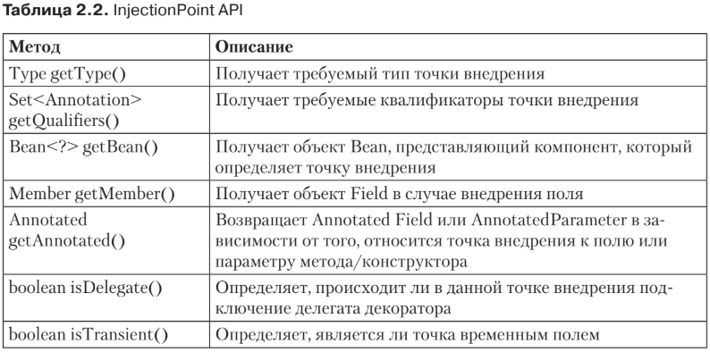

# @Inject
* Поскольку Java EE является управляемой средой, вам не придется конструировать
зависимости вручную. Вместо вас ссылку может внедрить контейнер. Одним сло-
вом, внедрение зависимостей CDI — это возможность внедрять одни компоненты
в другие с сохранением безопасности типов, что означает использование XML
вместо аннотаций.

* Внедрение уже существовало в Java EE 5 с такими аннотациями, как @Resource,
@PersistentUnit и EJB. Но оно было ограничено до определенных ресурсов (баз дан-
ных, архитектура EJB) и компонентов (сервлетов, компонентов EJB, связующих
компонентов JSF и т. д.). С помощью CDI вы можете внедрить практически что
угодно и куда угодно благодаря аннотации @Inject. Обратите внимание, что в Java
EE 7 разрешено использовать другие механизмы внедрения (@Resource), однако
лучше стараться применять @Inject везде, где это возможно (см. подраздел «Про-
изводители данных» раздела «Создание компонента CDI» этой главы).

Внедрение может происходить с помощью трех различных механизмов: 
* свойства
    ```xml
      @Inject
      private NumberGenerator numberGenerator;
    ```
* сеттера
    ```xml
      @Inject
      public void setNumberGenerator(NumberGenerator numberGenerator) {
      this.numberGenerator = numberGenerator;
      }
    ```
* конструктора
    ```xml
       @Inject
       public BookService(NumberGenerator numberGenerator) {
       this.numberGenerator = numberGenerator;
       }
    ```

## Внедрение по умолчанию
    ```xml
      @Inject
      private NumberGenerator numberGenerator;
    ```
* Это называется внедрением по умолчанию. Каждый раз, когда компонент или
точка внедрения не объявляет очевидным образом квалификатор, контейнер по
умолчанию использует квалификатор @javax.enterprise.inject.Default. На самом
деле предыдущему отрывку кода идентичен следующий:
    ```xml
       @Inject @Default
       private NumberGenerator numberGenerator;
    ```
* @Default — это встроенный квалификатор, сообщающий CDI, когда нужно вне-
дрить реализацию компонента по умолчанию. Если вы определите компонент без
квалификатора, ему автоматически присвоится квалификатор @Default.

## Квалификаторы
* Это аннотация, которая  определяется пользователем и, в свою очередь, 
сопровождается аннотацией @javax.inject.Qualifer.
    ```xml
       @Qualifier
       @Retention(RUNTIME)
       @Target({FIELD, TYPE, METHOD})
       public @interface ThirteenDigits { }
  
      @Qualifier
      @Retention(RUNTIME)
      @Target({FIELD, TYPE, METHOD})
      public @interface EightDigits { }
    ```
## Альтернативы
@javax.enterprise.inject.Alternative
* Альтернативы — это компоненты, аннотированные специальным квалификатором
javax.enterprise.inject.Alternative. По умолчанию альтернативы отключены,
и чтобы сделать их доступными для инстанцирования и внедрения, необходимо
активизировать их в дескрипторе beans.xml. В листинге 2.14 показана альтернатива
имитационного генератора чисел.
* По умолчанию компоненты @Alternative отключены, и вам необходимо активи-
  зировать их явным образом в дескрипторе beans.xml.
    ```xml
       <beans xmlns=" http://xmlns.jcp.org/xml/ns/javaee"
       xmlns:xsi=" http://www.w3.org/2001/XMLSchema-instance"
       xsi:schemaLocation="http://xmlns.jcp.org/xml/ns/javaee
       http://xmlns.jcp.org/xml/ns/javaee/beans_1_1.xsd"
       version="1.1" bean-discovery-mode="all">
          <alternatives>
              <class>org.agoncal.book.javaee7.chapter02.MockGenerator</class>
          </alternatives>
       </beans>
    ```
## Производители данных
@javax.enterprise.inject.Produces
* Благодаря производителям данных вы также можете внедрять примитивы (такие как int, long, float и т. д.),
массивы и любой POJO, не поддерживающий CDI. Под поддержкой CDI я имею
в виду любой класс, упакованный в архив, содержащий файл beans.xml.

* По умолчанию вы не можете внедрять такие классы, как java.util.Date или ja-
va.lang.String. Так происходит потому, что все эти классы упакованы в файл rt.jar
(классы среды исполнения Java), а этот архив не содержит дескриптор разверты-
вания beans.xml. Если в архиве в папке META-INF нет файла beans.xml, CDI не ини-
циирует обнаружение компонента и POJO не будут обрабатываться как компонен-
ты, а значит, и внедряться.

### InjectionPoint API
* Атрибуты и возвращаемое значение, полученное посредством @Produces, 
не требуют никакой информации о том, куда они
внедряются. Но в определенных случаях объектам нужна информация о точке их
внедрения. Это может быть способ конфигурации или изменения поведения в за-
висимости от точки внедрения.



* Например, рассмотрим создание автоматического журнала. В JDK для созда-
ния java.util.logging.Logger вам необходимо задать категорию класса, владе-
ющего им. Скажем, если вам нужен автоматический журнал для BookService,
следует написать:

    ```xml
       Logger log = Logger.getLogger(BookService.class.getName());
    ```

* Как бы вы получили Logger, которому необходимо знать имя класса точки вне-
дрения? В CDI есть InjectionPoint API, обеспечивающий доступ к метаданным,
которые касаются точки внедрения (табл. 2.2). Таким образом, вам необходимо
создать метод производителя данных, который использует InjectionPoint API для
конфигурации правильного автоматического журнала. В листинге 2.18 показано,
как метод createLogger получает имя класса точки внедрения.
    ```xml
       Производитель данных автоматического журнала
       public class LoggingProducer {
       @Produces
       private Logger createLogger(InjectionPoint injectionPoint) {
          return Logger.getLogger(injectionPoint.getMember().getDeclaringClass().
          getName());
          }
       }
    ```
* Чтобы использовать произведенный автоматический журнал в любом компо-
ненте, вы просто внедряете его и работаете с ним. Имя класса категории автомати-
ческого журнала потом будет задано автоматически:
    ```xml
       @Inject Logger log;
    ``` 
## Утилизаторы
@javax.enterprise.inject.Disposes
* В предыдущих примерах (см. листинги 2.17 и 2.18) мы использовали произво-
дителей данных для создания типов данных или объектов POJO таким образом,
чтобы они могли быть внедрены. Мы создали их, и, пока они использовались,
нам не требовалось разрушать или закрывать их. Но некоторые методы произ-
водителей данных возвращают объекты, требующие явного разрушения, напри-
мер интерфейс Java Database Connectivity (JDBC), сеанс JMS или менеджер
сущности. Для создания CDI использует производителей данных, а для раз-
рушения — утилизаторы. Метод утилизатора позволяет приложению выполнять
настраиваемую очистку объекта, возвращенного методом производителя дан-
ных.

* Показывает утилитный класс, который создает и закрывает интер-
фейс JDBC. Метод createConnection берет драйвер Derby JDBC, создает соединение
с определенным URL, обрабатывает исключения и возвращает открытое соедине-
ние JDBC. Это сопровождается аннотацией @Disposes.
    ```xml
    public class JDBCConnectionProducer {
    @Produces
    private Connection createConnection() {
        Connection conn = null;
        try {
            Class.forName("org.apache.derby.jdbc.EmbeddedDriver").newInstance();
            conn = DriverManager.getConnection("jdbc:derby:memory:chapter02DB",
            "APP", "APP");
        } catch (InstantiationException | IllegalAccessException | ClassNotFoundException) {
            e.printStackTrace();
        }
        return conn;
    }
  
    private void closeConnection(@Disposes Connection conn) throws SQLException
    {
        conn.close();
        }
    }
    ```