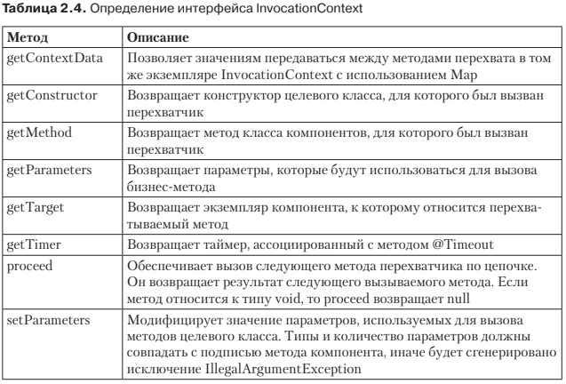
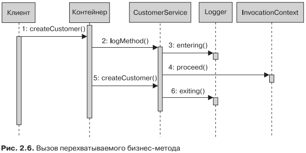

# Перехватчики
* Перехватчики позволяют добавлять к вашим компонентам сквозную функциональ-
ность. Как показано на рис. 2.2, когда клиент вызывает метод на управляемом
компоненте (а значит, и на компоненте CDI, EJB либо веб-службе RESTful и т. д.),
74 Глава 2. Контекст и внедрение зависимостей
контейнер может перехватить вызов и обработать бизнес-логику перед тем, как
будет вызван метод компонента. Перехватчики делятся на четыре типа:

#### @AroundConstruct
* Перехватчики, действующие на уровне конструктора, — перехватчик, ассоци-
ированный с конструктором целевого класса (@AroundConstruct)

#### @AroundInvoke
* Перехватчики, действующие на уровне метода, — перехватчик, ассоциированный
со специальным бизнес-методом (@AroundInvoke)

#### @AroundTimeout
* Перехватчики методов задержки — перехватчик, помеченный аннотацией @AroundTimeout, 
вмешивается в работу методов задержки (применяется только со службой времени EJB)

#### @PostConstruct и @PreDestroy
* Перехватчики обратного вызова жизненного цикла — перехватчик, который
вмешивается в работу обратных вызовов событий жизненного цикла целевого
экземпляра (@PostConstruct и @PreDestroy).

## Перехватчики целевого класса
* Существует несколько способов определения перехвата. Самый простой — добавить
перехватчики (уровня метода, тайм-аута или жизненного цикла) к самому компонен-
ту, как показано в листинге 2.23. Класс CustomerService сопровождает logMethod() ан-
нотацией @AroundInvoke. Этот метод используется для регистрации сообщения во
время входа в метод и выхода из него. Как только этот управляемый компонент раз-
вертывается, любой клиентский вызов createCustomer() или findCustomerById() будет
перехватываться и начнет применяться logMethod(). Обратите внимание, что область
видимости этого перехватчика ограничена самим компонентом (целевым классом).
```xml
    @Transactional
    public class CustomerService {
        @Inject
        private EntityManager em;
        @Inject
        private Logger logger;

        public void createCustomer(Customer customer) {
            em.persist(customer);
        }

        public Customer findCustomerById(Long id) {
            return em.find(Customer.class, id);
        }

        @AroundInvoke
        private Object logMethod(InvocationContext ic) throws Exception {
            logger.entering(ic.getTarget().toString(), ic.getMethod().getName());
            try {

                Перехватчики 75

                return ic.proceed();
            } finally {
                logger.exiting(ic.getTarget().toString(), ic.getMethod().getName());
            }
        }
    }
```
* Несмотря на аннотацию @AroundInvoke, logMethod() должен иметь следующий
образец подписи:
```xml
    @AroundInvoke
    Object <METHOD>(InvocationContext ic) throws Exception;
```
* Следующие правила относятся к методу, предшествующему вызову (а также
конструктору, времени задержки или перехватчикам жизненного цикла):

    * метод может иметь доступ public, private, protected либо доступ на уровне пакета, 
    но не должно быть доступа static или final;
    * метод должен иметь параметр javax.interceptor.InvocationContext и возвращать
    объект, который является результатом вызванного метода проб;
    * метод может генерировать проверяемое исключение.
* Объект InvocationContext позволяет перехватчикам контролировать поведение
цепочки вызовов. Если несколько перехватчиков соединены в цепочку, то один
и тот же экземпляр InvocationContext передается каждому перехватчику, который
может добавить контекстуальные данные для обработки другими перехватчиками.
Таблица 2.4 описывает API InvocationContext.

* Чтобы понять, как работает код в листинге 2.23, взгляните на схему последова-
тельности на рис. 2.6. Вы увидите, что происходит, когда клиент вызывает метод
createCustomer(). Прежде всего контейнер перехватывает вызов и вместо прямой
обработки createCustomer() сначала вызывает метод logMethod(). Данный метод ис-
пользует интерфейс InvocationContext для получения имени вызываемого компо-
нента (ic.getTarget()), а вызываемый метод (ic.getMethod()) применяет для реги-
страции сообщения о входе (logger.entering()). Затем вызывается метод proceed().
Вызов InvocationContext.proceed() очень важен, поскольку сообщает контейнеру,
что тот должен обрабатывать следующий перехватчик или вызывать бизнес-метод
компонента. При отсутствии вызова proceed() цепочка перехватчиков будет оста-
новлена, а бизнес-метод не будет вызван. В конце вызывается метод createCustomer(),
и как только он возвращается, перехватчик прекращает выполнение, регистрируя
сообщение о выходе (logger.exiting()). Вызов клиентом метода findCustomerById()
происходил бы в той же последовательности.


## Перехватчики классов
* Но чаще всего вам требуется изолировать сквозную функциональность в отдельный
класс и сообщить контейнеру, чтобы он перехватил вызовы нескольких компонен-
тов. Запись информации в журнал (логирование) — типичный пример ситуации,
когда вам требуется, чтобы все методы всех ваших компонентов регистрировали
сообщения о входе и выходе. Для указания перехватчика класса вам необходимо
разработать отдельный класс и дать контейнеру команду применить его на опреде-
ленном компоненте или методе компонента.
* Чтобы обеспечить совместный доступ к коду множественным компонентам,
возьмем методы logMethod() из листинга 2.23 и изолируем их в отдельный класс,
как показано в листинге 2.24. Обратите внимание на метод init(), который сопро-
вождается аннотацией @AroundConstruct и будет вызван только вместе с конструк-
тором компонента.
```xml
    public class LoggingInterceptor {
        @Inject
        private Logger logger;

        @AroundConstruct
        private void init(InvocationContext ic) throws Exception {
            logger.fine("Entering constructor");
            try {
                ic.proceed();
            } finally {
                logger.fine("Exiting constructor");
            }
        }

        @AroundInvoke
        public Object logMethod(InvocationContext ic) throws Exception {
            logger.entering(ic.getTarget().toString(), ic.getMethod().getName());
            try {
                return ic.proceed();
            } finally {
                logger.exiting(ic.getTarget().toString(), ic.getMethod().getName());
            }
        }
    }
```
* Теперь LoggingInterceptor может быть прозрачно обернут любым компонентом,
заинтересованным в этом перехватчике. Для этого компоненту необходимо сооб-
щить контейнеру аннотацию @javax.interceptor.Interceptors. В листинге 2.25 ан-
нотация задается методом createCustomer(). Это означает, что любой вызов этого
метода будет перехвачен контейнером, и будет вызван класс LoggingInterceptor
(регистрация сообщения на входе в метод и выходе из него).
```xml
    @Transactional
    public class CustomerService {
        @Inject
        private EntityManager em;

        @Interceptors(LoggingInterceptor.class)
        public void createCustomer(Customer customer) {
            em.persist(customer);
        }

        public Customer findCustomerById(Long id) {
            return em.find(Customer.class, id);
        }
    }
```
* Аннотация @Interceptors прикрепляется только к методу
createCustomer(). Это означает, что, если клиент вызывает findCustomerById(), кон-
тейнер не будет перехватывать вызов. Если вы хотите, чтобы перехватывались
вызовы обоих методов, можете добавить аннотацию @Interceptors либо сразу к обо-
им методам, либо к самому компоненту. Когда вы это делаете, перехватчик приво-
дится в действие при вызове любого из методов. А поскольку перехватчик имеет
аннотацию @AroundConstruct, вызов конструктора тоже будет перехвачен.
```xml
    @Transactional
    @Interceptors(LoggingInterceptor.class)
    public class CustomerService {
        public void createCustomer(Customer customer) {...}

        public Customer findCustomerById(Long id) {...}
    }
```
* Если ваш компонент имеет несколько методов и вы хотите применить пере-
хватчик ко всему компоненту за исключением определенного метода, можете ис-
пользовать аннотацию javax.interceptor.ExcludeClassInterceptors для исключения
перехвата вызова. В следующем отрывке кода вызов к updateCustomer() не будет
перехвачен, а остальные будут:
```xml
    @Transactional
    @Interceptors(LoggingInterceptor.class)
    public class CustomerService {
        public void createCustomer(Customer customer) {...}

        public Customer findCustomerById(Long id) {...}

        @ExcludeClassInterceptors
        public Customer updateCustomer(Customer customer) { ...}
    }
```
## Перехватчик жизненного цикла
* В начале этой главы я рассказывал о жизненном цикле управляемого компонен-
та (см. рис. 2.2) и событиях обратного вызова. С помощью аннотации обратного
вызова вы можете дать контейнеру команду вызвать метод в определенной фазе
жизненного цикла (@PostConstruct и @PreDestroy). Например, если вы хотите
вносить в журнал запись каждый раз, когда создается экземпляр компонента,
вам просто нужно присоединить аннотацию @PostConstruct к методу вашего ком-
понента и добавить к ней некоторые механизмы записи в журнал. Но что, если
вам нужно перехватывать события жизненного цикла многих типов компонен-
тов? Перехватчики жизненного цикла позволяют изолировать определенный
код в отдельный класс и вызывать его, когда приводится в действие событие
жизненного цикла.
* Демонстрирует класс ProfileInterceptor с двумя методами:
logMethod(), который используется для постконструкции, и profile(), применяемый
для перехвата методов (@AroundInvoke).
```xml
public class ProfileInterceptor {
        @Inject
        private Logger logger;

        @PostConstruct
        public void logMethod(InvocationContext ic) throws Exception {
            logger.fine(ic.getTarget().toString());
            try {
                ic.proceed();
            } finally {
                logger.fine(ic.getTarget().toString());
            }
        }

        @AroundInvoke
        public Object profile(InvocationContext ic) throws Exception {
            long initTime = System.currentTimeMillis();
            try {
                return ic.proceed();
            } finally {
                long diffTime = System.currentTimeMillis() - initTime;
                logger.fine(ic.getMethod() + " took " + diffTime + " millis");
            }
        }
    }
```
* Как видно из листинга 2.26, перехватчики жизненного цикла берут параметр
InvocationContext и вместо Object возвращают void. Чтобы применить перехватчик,
определенный в листинге 2.26, компонент CustomerService (листинг 2.27) должен
использовать аннотацию @Interceptors и определять ProfileInterceptor. Если ком-
понент инстанцируется контейнером, метод logMethod() будет вызван раньше ме-
тода init(). Затем, если клиент вызывает createCustomer() или findCustomerById(),
будет вызван метод profile().
```xml
    @Transactional
    @Interceptors(ProfileInterceptor.class)
    public class CustomerService {
        @Inject
        private EntityManager em;

        @PostConstruct
        public void init() {
        }

        public void createCustomer(Customer customer) {
            em.persist(customer);
        }

        public Customer findCustomerById(Long id) {
            return em.find(Customer.class, id);
        }
    }
```
## Связывание и исключение перехватчиков
* Вы уже видели, как перехватываются вызовы в пределах одного компонента (с ан-
нотацией @Around Invoke), а также среди множественных компонентов (с использо-
ванием аннотации @Interceptors). Спецификация Interceptors 1.2 также позволяет
связать в цепочку несколько перехватчиков.
* В действительности аннотация @Interceptors способна прикреплять более одно-
го перехватчика, так как в качестве параметра она берет список перехватчиков,
разделенных запятой. Когда определяются множественные перехватчики, порядок
их вызова задается тем порядком, в котором они указаны в аннотации @Interceptors.
Например, код в листинге 2.28 использует аннотацию @Interceptors у компонента
и на уровне методов.
```xml
    @Stateless
    @Interceptors({I1.class, I2.class})
    public class CustomerService {
        public void createCustomer(Customer customer) {...}

        @Interceptors({I3.class, I4.class})
        public Customer findCustomerById(Long id) {...}

        public void removeCustomer(Customer customer) {...}

        @ExcludeClassInterceptors
        public Customer updateCustomer(Customer customer) {...}
    }
```
* Когда клиент вызывает метод updateCustomer(), перехватчик не вызывается, так как
метод аннотирован @ExcludeClassInterceptors. При вызове метода createCustomer()
выполняется перехватчик I1, за которым следует перехватчик I2. При вызове метода
findCustomerById() перехватчики I1, I2, I3 и I4 выполняются в соответствующем по-
рядке.
## Связывание с перехватчиком
* Перехватчики определяются в своей собственной спецификации (запрос JSR 318)
и могут использоваться в любых управляемых компонентах (EJB, сервлетах, веб-
службах RESTful и т. д.). Но CDI расширил исходную спецификацию, добавив
к ней связывание с перехватчиком. Это означает, что связывание с перехватчиком
может применяться только тогда, когда активизирован CDI.
* Если вы посмотрите на листинг 2.25, то увидите, как работают перехватчики.
Реализацию перехватчика необходимо указывать непосредственно на реализации
компонента (например, @Interceptors(LoggingInterceptror.class)). Это типобезо-
пасно, но нет слабой связи. CDI обеспечивает связывание с перехватчиком, которое
представляет определенный уровень косвенности и слабой связанности. Тип свя-
зывания с перехватчиком — это определенная пользователем аннотация, также
сопровождаемая аннотацией @InterceptorBinding, которая связывает класс пере-
хватчика с компонентом без прямой зависимости между этими двумя классами.
* Показывает связывание с перехватчиком под названием Loggable.
Как видите, данный код очень похож на квалификатор. Связывание с перехватчи-
ком — это аннотация, также аннотированная @InterceptorBinding, которая может
быть пустой или иметь члены (например, как в листинге 2.13).
```xml
    @InterceptorBinding
    @Target({METHOD, TYPE})
    @Retention(RUNTIME)
    public @interface Loggable { }
```
* При наличии связывания с перехватчиком необходимо прикрепить его к само-
му перехватчику. Для этого к перехватчику добавляется аннотация @Interceptor
и связывание с перехватчиком (Loggable в листинге 2.30).
```xml
    @Interceptor
    @Loggable
    public class LoggingInterceptor {
        @Inject
        private Logger logger;

        @AroundInvoke
        public Object logMethod(InvocationContext ic) throws Exception {
            logger.entering(ic.getTarget().toString(), ic.getMethod().getName());
            try {
                return ic.proceed();
            } finally {
                logger.exiting(ic.getTarget().toString(), ic.getMethod().getName());
            }
        }
    }
```
* Теперь вы можете применить перехватчик к компоненту, проаннотировав класс
компонента той же связкой перехватчиков, которая показана в листинге 2.31. Это
дает вам слабую связанность (так как класс реализации явно не указывается) и не-
плохой уровень косвенности.
```xml
    @Transactional
    @Loggable
    public class CustomerService {
        @Inject
        private EntityManager em;
        public void createCustomer(Customer customer) {
            em.persist(customer);
        }
        public Customer findCustomerById(Long id) {
            return em.find(Customer.class, id);
        }
    }
```
* Связывание перехватчиков находится на компоненте. Это озна-
чает, что каждый метод будет перехватываться и записываться в журнал. Но, как
и всегда в таких случаях, можно связывать перехватчик с отдельным методом, а не
с целым компонентом.
```xml
    @Transactional
    public class CustomerService {
        @Loggable
        public void createCustomer(Customer customer) {...}
        public Customer findCustomerById(Long id) {...}
    }
```

#### Перехватчики специфичны для развертывания и отключены по умолчанию.
* Как и альтернативы, перехватчики необходимо активизировать, используя де-
скриптор развертывания beans.xml JAR-файла или модуля Java EE, как показано
в листинге 2.32.
```xml
<beans xmlns="http://xmlns.jcp.org/xml/ns/javaee"
xmlns:xsi="http://www.w3.org/2001/XMLSchema-instance"
xsi:schemaLocation="http://xmlns.jcp.org/xml/ns/javaee
http://xmlns.jcp.org/xml/ns/javaee/beans_1_1.xsd"
version="1.1" bean-discovery-mode="all">
<interceptors>
    <class>org.agoncal.book.javaee7.chapter02.LoggingInterceptor</class>
</interceptors>
</beans>
```
## Приоритизация связывания перехватчиков
* Связывание перехватчиков обеспечивает определенный уровень косвенности, одна-
ко лишает возможности упорядочивать перехватчики, как показано в листинге 2.28
(@Interceptors({I1.class, I2.class})). Согласно CDI 1.1 вы можете приоритизировать
их, используя аннотацию @javax.annotation.Priority (либо ее XML-эквивалент в фай-
ле beans.xml) вместе со значением приоритета, как показано в листинге 2.33.
```xml
    @Interceptor
    @Loggable
    @Priority(200)
    public class LoggingInterceptor {
        @Inject
        private Logger logger;

        @AroundInvoke
        public Object logMethod(InvocationContext ic) throws Exception {
            logger.entering(ic.getTarget().toString(), ic.getMethod().getName());
            try {
                return ic.proceed();
            } finally {
                logger.exiting(ic.getTarget().toString(), ic.getMethod().getName());
            }
        }
    }
```
* Аннотация @Priority берет целое число, которое может принимать любое зна-
чение. Правило состоит в том, что перехватчики с меньшим приоритетом называ-
ются первыми. Java EE 7 определяет приоритеты уровня платформы, после чего
ваши перехватчики могут вызываться до или после определенных событий. Анно-
тация javax.interceptor.Interceptor определяет следующий набор констант:
    * PLATFORM_BEFORE = 0 — начинает диапазон для ранних перехватчиков, опреде-
ляемых платформой Java EE;
    * LIBRARY_BEFORE = 1000 — открывает диапазон для ранних перехватчиков, зада-
ваемых библиотеками расширения;
    * APPLICATION = 2000 — начинает диапазон для ранних перехватчиков, определя-
емых приложениями;
    * LIBRARY_AFTER = 3000 — открывает диапазон для поздних перехватчиков, зада-
ваемых библиотеками расширения;
    * PLATFORM_AFTER = 4000 — начинает диапазон для поздних перехватчиков, опреде-
ляемых платформой Java EE.
* Поэтому, если вы хотите, чтобы ваш перехватчик выполнялся до любого пере-
хватчика приложения, но после любого раннего перехватчика платформы, можете
написать следующее:
```xml
@Interceptor
@Loggable
@Priority(Interceptor.Priority.LIBRARY_BEFORE + 10)
public class LoggingInterceptor {...}
```