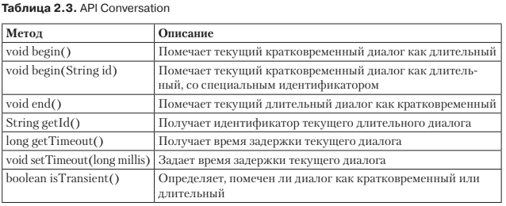

# Области видимости
* CDI имеет отношение не только к внедрению зависимостей, но и к контексту (бук-
ва С в аббревиатуре CDI означает контекст). Каждый объект, управляемый CDI,
имеет строго определенные область видимости и жизненный цикл, которые связа-
ны с конкретным контекстом. В Java область применения POJO достаточно проста:
вы создаете экземпляр класса, используя ключевое слово new, и позволяете сбор-
щику мусора избавиться от него, чтобы освободить некоторое количество памяти.

* При использовании CDI компонент связан с контекстом и остается в нем до тех
пор, пока не будет разрушен контейнером. Удалить компонент из контекста вруч-
ную невозможно.

* В то время как веб-уровень имеет четко определенные области видимости (при-
ложение, сеанс, запрос), на уровне сервисов такого не было (см. также главу 7
о компонент-сеансах EJB с сохранением и без сохранения состояния). Ведь, когда
компонент-сеансы или POJO используются в веб-приложениях, они не оповеща-
ются о контекстах этих приложений. CDI соединил веб-уровень с уровнем серви-
сов с помощью содержательных областей видимости. Он определяет следующие
встроенные области видимости и даже предлагает точки расширения, в которых вы
можете создавать собственные области видимости.

#### @ApplicationScoped
* Область видимости приложения (@ApplicationScoped) — действует на протяжении
всей работы приложения. Компонент создается только один раз на все время
работы приложения и сбрасывается, когда оно закрывается. Эта область види-
мости полезна для утилитных или вспомогательных классов либо объектов,
которые хранят данные, используемые совместно целым приложением. Однако
необходимо проявить осторожность в вопросах конкурентного доступа, когда
доступ к данным должен осуществляться по нескольким потокам.

#### @SessionScoped
* Область видимости сеанса (@SessionScoped) — действует на протяжении не-
скольких запросов HTTP или нескольких вызовов метода для одного пользо-
вательского сеанса. Компонент создается на все время длительности HTTP-
сеанса и сбрасывается, когда сеанс заканчивается. Эта область видимости
предназначена для объектов, требуемых на протяжении сеанса, таких как поль-
зовательские настройки или данные для входа в систему.

#### @RequestScoped
* Область видимости запроса (@RequestScoped) — соответствует единственному
HTTP-запросу или вызову метода. Компонент создается на все время вызова
метода и сбрасывается по его окончании. Он используется для классов обслу-
живания или связующих компонентов JSF, которые нужны только на протяже-
нии HTTP-запроса.

#### @ConverationScoped
* Область видимости диалога (@ConverationScoped) — действительна между мно-
жественными вызовами в рамках одной сессии, ее начальная и конечная точка
определяются приложением. Диалоги используются среди множественных
страниц как часть многоступенчатого рабочего потока.

#### @Dependent
* Зависимая псевдообласть видимости (@Dependent) — ее жизненный цикл совпадает
с жизненным циклом клиента. Зависимый компонент создается
каждый раз при внедрении, а ссылка удаляется одновременно с удалением
целевой точки внедрения. Эта область видимости по умолчанию предназна-
чена для CDI.

#### @SessionScoped или @ConversationScoped
* Обратите внимание, что компоненты с областью видимости @SessionScoped 
или @ConversationScoped должны быть сериализуемыми, так как контейнер периодически пассивизирует их.

#### @ConversationScoped
* Диалог. Область видимости диалога несколько отличается от областей види-
мости приложения, сеанса или запроса. Она хранит состояние, ассоциированное
с пользователем, распространяется сразу на много запросов и программно от-
граничивается от остального кода на уровне приложения. Компонент с аннота-
цией @ConversationScoped может использоваться для длительных процессов,
имеющих начало и конец, таких как навигация по мастеру или покупка товаров
и подтверждение и оплата заказа.
```xml
    @ConversationScoped
    public class CustomerCreatorWizard implements Serializable {
        private Login login;
        private Account account;
        @Inject
        private CustomerService customerService;
        @Inject
        private Conversation conversation;

        public void saveLogin() {
            conversation.begin();
            login = newLogin();
// Задает свойства учетных данных
        }

        public void saveAccount() {
            account = new Account();
// Задает свойства учетной записи
        }

        public void createCustomer() {
            Customer customer = new Customer();
            customer.setLogin(login);
            customer.setAccount(account);
            customerService.createCustomer(customer);
            conversation.end();
        }
    }
```
