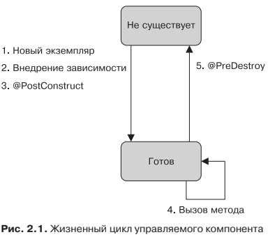
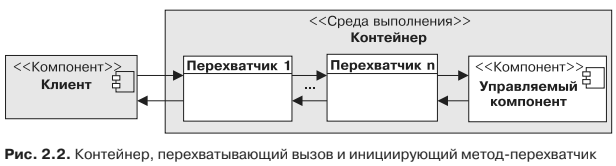
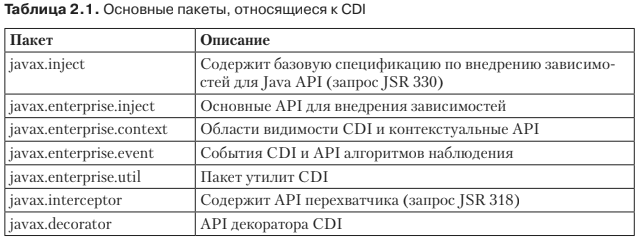

# Внедрение зависимостей

* Внедрение зависимостей (DI) — это шаблон разработки, в котором разделяются
  зависимые компоненты. Здесь мы имеем дело с инверсией управления, причем
  инверсии подвергается процесс получения необходимой зависимости.
  
  * DI (@Resource, @PersistenceContext, @PersistenceUnit, @EJB, @WebServiceRef)
  * JNDI
  
## Управление жизненным циклом

## Области видимости и контекст
* Компоненты CDI могут сохранять свое состояние и являются контекстуальными.
Это означает, что они живут в пределах четко определенной области видимости.
В CDI такие области видимости предопределены в пределах запроса, сеанса, при-
ложения и диалога. Например, контекст сеанса и его компоненты существуют
в течение жизни сеанса HTTP. В течение этого времени внедренные ссылки на
компоненты также оповещены о контексте. Таким образом, целая цепочка зависи-
мостей компонентов является контекстуальной. Контейнер автоматически управ-
ляет всеми компонентами в пределах области видимости, а в конце сессии автома-
тически уничтожает их.

## Перехват
* Методы-перехватчики используются для вставки между вызовами бизнес-
методов. Это похоже на аспектно-ориентированное программирование (АОП).
АОП — это парадигма программирования, отделяющая задачи сквозной функ-
циональности (влияющие на приложение) от вашего бизнес-кода.

## Перехват
 

## Слабая связанность и строгая типизация
* Перехватчики — это очень мощный способ отделения технических задач от бизнес-
логики. Контекстуальное управление жизненным циклом также отделяет компо-
ненты от управления их собственными жизненными циклами. При использовании
внедрения компонент не оповещается о конкретной реализации любого компонен-
та, с которым он взаимодействует. Но в CDI существуют и другие методы для
ослабления связанности. Компоненты могут использовать уведомления о событи-
ях для отделения производителей события от его потребителей либо применять
декораторы для отделения бизнес-логики. Другими словами, слабая связанность —
это ДНК, на котором построен CDI.

## Дескриптор развертывания
* Почти каждая спецификация Java EE содержит опциональный дескриптор развер-
тывания XML. Обычно он описывает, как компонент, модуль или приложение (на-
пример, корпоративное или веб-приложение) должны быть сконфигурированы. При
использовании CDI дескриптор развертывания называется beans.xml и является
обязательным.

## Краткая история спецификаций CDI
* В 2006 году Гевин Кинг (создатель Seam), вдохновленный идеями фреймворков
Seam, Guise и Spring, возглавил работу над спецификацией по запросу JSR 299,
позднее названной Web Beans (Веб-компоненты). Поскольку она создавалась для
Java EE 6, ее пришлось переименовать в Context and Dependency Injection 1.0. При
этом за основу был взят новый запрос JSR 330: Dependency Injection for Java 1.0
(также известный как @Inject).
* Внедрение зависимостей для Java определяло набор
аннотаций:
    * @Inject
    * @Named
    * @Qualifier
    * @Scope
    * @Singleton
    
## Пакеты
 

## Внутренняя организация компонента CDI
* В соответствии со спецификацией CDI 1.1 контейнер распознает как компонент
CDI любой класс, если:
  * он не относится к нестатичным внутренним классам;
  * это конкретный класс либо класс, имеющий аннотацию @Decorator;
  * он имеет задаваемый по умолчанию конструктор без параметров либо объявляет конструктор с аннотацией @Inject.