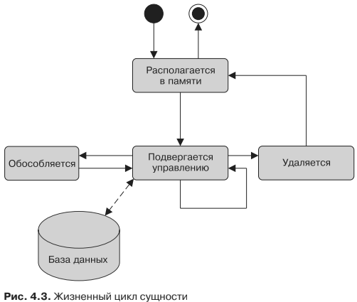

#Жизненный цикл сущности и обратные вызовы
Сущности представляют собой всего лишь POJO. Когда EntityManager управляет
POJO, у них имеется идентификатор постоянства (ключ, который уникально иден-
тифицирует экземпляр и является эквивалентом первичного ключа), а база данных
синхронизирует их состояние. Когда управление ими не осуществляется (то есть
они обособлены от EntityManager), их можно использовать как любой другой Java-
класс. Это означает, что у сущностей имеется жизненный цикл (рис. 4.3). Когда вы
создадите экземпляр сущности Book с помощью оператора new, объект будет рас-
полагаться в памяти, а JPA ничего не будет знать о нем (этот объект даже может
перестать существовать в результате сборки мусора) Когда им начнет управлять
EntityManager, таблица BOOK отобразит и синхронизирует его состояние. Вызов ме-
тода EntityManager.remove() приведет к удалению соответствующей информации из
базы данных, однако Java-объект продолжит находиться в памяти, пока не исчезнет
в результате сборки мусора.

Операции с сущностями подпадают под четыре категории: 
* обеспечение постоянства 
* обновление
* удаление
* загрузка 

— аналогичные категориям операций
с базами данных, к которым относятся соответственно вставка, обновление, уда-
ление и выборка. Для каждой операции имеют место события с приставками pre
и post (за исключением загрузки, для которой имеет место только событие с при-
ставкой post). Эти события могут быть перехвачены EntityManager для вызова
бизнес-метода. Как вы увидите в главе 6, в вашем распоряжении будут аннотации
* @PrePersist
* @PostPersist 
 
 и т. д. JPA позволяет вам привязывать бизнес-логику
к определенной сущности, когда имеют место эти события. Упомянутые аннотации
могут быть применены к методам сущностей (также известным как методы об-
ратного вызова) или внешним классам (также известным как слушатели). Вы мо-
жете представлять себе методы обратного вызова и слушатели как аналогичные
триггеры в реляционной базе данных.