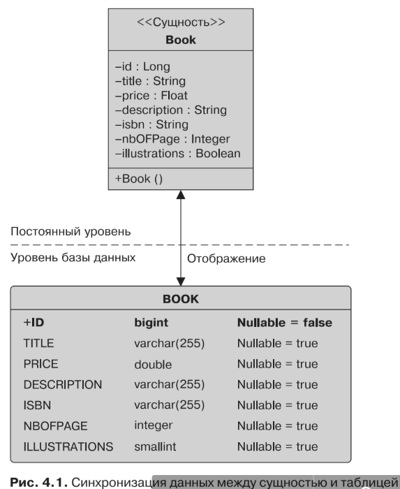

#Объектно-реляционное отображение
* Принцип объектно-реляционного отображения заключается в возложении на
внешние инструменты или фреймворки (в нашем случае JPA) задачи по обеспече-
нию соответствия между объектами и таблицами. Тогда мир классов, объектов
и атрибутов можно будет отобразить в реляционные базы данных, состоящие из
таблиц, которые содержат строки и столбцы. Отображение обеспечивает объектно-
ориентированное представление для разработчиков, которые смогут прозрачно
использовать сущности вместо таблиц. Как именно JPA отображает объекты в базе
данных? Ответ: с помощью метаданных.
* С каждой сущностью ассоциированы метаданные, которые описывают ото-
бражение. Они позволяют поставщику постоянства распознать сущность и интер-
претировать отображение. Метаданные могут быть записаны в двух разных фор-
матах.
    * Аннотации — код сущности непосредственно снабжается всевозможными ан-
нотациями, описанными в пакете javax.persistence.
    * XML-дескрипторы — вместо аннотаций (или в дополнение к ним) вы можете
использовать XML-дескрипторы. Отображение определяется во внешнем XML-
файле, который будет развернут вместе с сущностями. Это может оказаться
очень полезным, если, к примеру, конфигурация базы данных будет изменять-
ся в зависимости от среды.
* В случае с сущностью Book (показанной в листинге 4.1) используются аннотации
JPA, чтобы поставщик постоянства смог синхронизировать данные между атрибу-
тами сущности Book и столбцами таблицы BOOK. Следовательно, если атрибут isbn
окажется модифицирован приложением, то будет синхронизирован столбец ISBN
(при управлении сущностью, задании контекста транзакций и т. д.).
* В версии Java EE 5 была представлена идея конфигурации в порядке исклю-
чения (иногда называемая программированием в порядке исключения или со-
глашением прежде конфигурации), которая по-прежнему активно используется
сегодня в Java EE 7. Это означает, что, если не указано иное, контейнер или по-
ставщик должен применять правила по умолчанию. Другими словами, необходи-
мость обеспечения конфигурации является исключением из правила. Это позво-
ляет вам написать минимальное количество кода для того, чтобы ваше приложение
работало, положившись на правила, применяемые контейнером и поставщиком
по умолчанию. Если вы не хотите, чтобы поставщик применял правила по умол-
чанию, то можете настроить отображение в соответствии со своими нуждами.
Иначе говоря, необходимость обеспечения конфигурации является исключением
из правила.
* Без аннотаций сущность Book в листинге 4.1 рассматривалась бы как простой
POJO, а ее постоянство не обеспечивалось бы. Это закон: если не предусмотрено


никакой специальной конфигурации, то должны применяться правила по умолча-
нию, а поставщик постоянства по умолчанию исходит из того, что у класса Book нет
представления базы данных. Но, поскольку вам необходимо изменить это поведе-
ние по умолчанию, вы снабжаете класс аннотацией 
* @Entity

То же самое и в случае с идентификатором. Вам нужен способ сообщить поставщику постоянства о том,
что атрибут id требуется отобразить в первичный ключ, поэтому вы снабжаете его
аннотацией 
* @Id

, а значение соответствующего идентификатора автоматически ге-
нерируется поставщиком постоянства с использованием опциональной аннотации
* @GeneratedValue

* Решение такого рода характеризует подход «конфигурация в порядке исключения», 
при котором аннотации не требуются в более общих случаях,
а используются, только когда необходимо переопределение. Это означает, что по
отношению ко всем прочим атрибутам будут применяться следующие правила
отображения по умолчанию.
    * Имя сущности будет отображаться в имя реляционной таблицы (например,
сущность Book отобразится в таблицу BOOK). Если вы захотите отобразить сущ-
ность в другую таблицу, то вам потребуется прибегнуть к аннотации @Table, как
вы увидите в разделе «Элементарное отображение» в следующей главе.
    * Имена атрибутов будут отображаться в имени столбца (например, атрибут id
или метод getId() отобразится в столбце ID). Если вы захотите изменить это ото-
бражение по умолчанию, то вам придется воспользоваться аннотацией @Column.
    * Правила JDBC применяются при отображении Java-примитивов в типах реля-
ционных данных. String отобразится в VARCHAR, Long — в BIGINT, Boolean — в SMALLINT
и т. д. Размер по умолчанию столбца, отображаемого из String, будет равен 255
(String отобразится в VARCHAR(255)). Однако имейте в виду, что правила отобра-
жения по умолчанию разнятся от одной базы данных к другой. Например, String
отображается в VARCHAR при использовании базы данных Derby и в VARCHAR2, если
применяется Oracle. Integer отображается в INTEGER в случае с базой данных
Derby и в NUMBER при использовании Oracle. Информация, касающаяся основной
базы данных, будет содержаться в файле persistence.xml, который вы увидите
позднее.
```xml
CREATE TABLE BOOK (
    ID BIGINT NOT NULL,
    TITLE VARCHAR(255),
    PRICE FLOAT,
    DESCRIPTION VARCHAR(255),
    ISBN VARCHAR(255),
    NBOFPAGE INTEGER,
    ILLUSTRATIONS SMALLINT DEFAULT 0,
PRIMARY KEY (ID)
)
```
* JPA2.1 предусматривает API-интерфейс и стандартный механизм для автома-
тического генерирования баз данных из сущностей и создания сценариев вроде
того, что показан в листинге 4.2. Это очень удобно, когда вы находитесь в режиме
разработки. Однако большую часть времени вам понадобится подключение к уна-
следованной базе данных, которая уже существует.
* Мир объектно-ориентированного программирования изобилует классами и ассо-
циациями между классами (и коллекциями классов). В случае с базами данных
также моделируются связи, но по-другому — с использованием внешних ключей
или таблиц соединения.