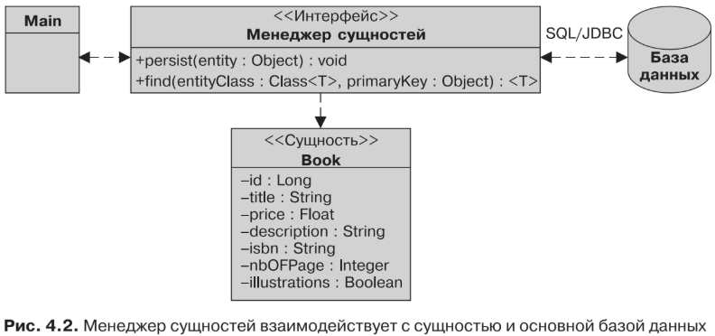

#Выполнение запросов к сущностям
JPA позволяет вам отображать сущности в базах данных, а также выполнять к ним
запросы с использованием разных критериев. Мощь JPA заключается в том, что он
дает возможность выполнять запросы к сущностям объектно-ориентированным
путем без необходимости применения внешних ключей или столбцов, относящихся
к основной базе данных. Центральным элементом API-интерфейса, отвечающего за
оркестровку сущностей, является 
* javax.persistence.EntityManager. 

Его роль состоит в управлении сущностями, их чтении и записи в определенную базу данных наряду
с обеспечением возможности проведения простых операций 
* CRUD (create, read, update, delete — «создание», «чтение», «обновление», «удаление»)

, а также комплексных запросов с применением JPQL. 
С технической точки зрения EntityManager представляет собой всего лишь интерфейс, 
реализация которого обеспечивается поставщиком постоянства (например, EclipseLink). 
В приведенном далее фрагменте кода показано, как получить EntityManager 
и обеспечить постоянство сущности Book:
```xml
EntityManagerFactory emf = Persistence.createEntityManagerFactory("chapter04PU");
EntityManager em = emf.createEntityManager();
em.persist(book);
```
* На рис. 4.2 продемонстрировано, как интерфейс менеджера сущностей может
быть использован классом (который здесь имеет имя Main) для манипулирования
сущностями (в данном случае Book). С помощью таких методов, как persist() и find(),
EntityManager скрывает JDBC-вызовы базы данных иоператор SQL (Structured Query
Language — язык структурированных запросов) INSERT или SELECT.
* Менеджер сущностей также позволяет вам выполнять запросы к сущностям. За-
прос в данном случае аналогичен запросу к базе данных за исключением того, что
вместо использования SQL интерфейс JPA выполняет запросы к сущностям с при-
менением JPQL. В его синтаксисе используется привычная точечная (.) нотация
объектов. Для извлечения информации обо всех книгах, в названии которых при-
сутствует H2G2, вы можете написать следующее:
```xml
SELECT b FROM Book b WHERE b.title = 'H2G2'
```

Следует отметить, что title является именем атрибута Book, а не именем столбца
таблицы. JPQL-операторы манипулируют объектами и атрибутами, а не таблицами
и столбцами. JPQL-оператор может выполняться с использованием динамических
(генерируемых динамически во время выполнения) или статических (определяемых
статически во время компиляции) запросов. Вы также можете выполнять «родные»
SQL-операторы и даже хранимые процедуры. Статические запросы, также известные
как именованные, определяются с использованием либо аннотаций (@NamedQuery),
либо XML-метаданных. Приведенный ранее JPQL-оператор может, к примеру, быть
определен как именованный запрос в отношении сущности Book. В листинге 4.3 по-
казана сущность Book с определением именованного запроса findBookH2G2 с помощью
аннотации @NamedQuery (более подробно о запросах мы поговорим в главе 6).
```xml
@Entity
@NamedQuery(name = "findBookH2G2",
        query = "SELECT b FROM Book b WHERE b.title ='H2G2'")
public class Book {
    @Id @GeneratedValue
    private Long id;
    private String title;
    private Float price;
    private String description;
    private String isbn;
    private Integer nbOfPage;
    private Boolean illustrations;
// Конструкторы, геттеры, сеттеры
}
```
EntityManager можно получить в стандартном Java-классе с использованием
фабрики. В листинге 4.4 показан такой класс, который создает сущность Book, обе-
спечивает ее постоянство в таблице и выполняет именованный запрос. Соответ-
ствующие действия он предпринимает с этапа 1 по 5.

* Создает экземпляр сущности Book. Сущности являются аннотированными
POJO, управляемыми поставщиком постоянства. С точки зрения Java экземпляр
класса, как и любой POJO, необходимо создавать с помощью ключевого слова
Рис. 4.2. Менеджер сущностей взаимодействует с сущностью и основной базой данных
new. Важно подчеркнуть, что до этой точки в коде поставщик постоянства не
осведомлен об объекте Book.
* Получает EntityManager и транзакцию. Это важная часть кода, поскольку
EntityManager необходим для манипулирования сущностями. Прежде всего
создается EntityManagerFactory для единицы сохраняемости chapter04PU. После
этого EntityManagerFactory задействуется для получения EntityManager (пере-
менная em), используется повсюду в коде для получения транзакции (перемен-
ная tx) и обеспечения постоянства и извлечения Book.
* Обеспечивает постоянство Book вбазе данных. Код начинает транзакцию (tx.begin())
и использует метод EntityManager.persist() для вставки экземпляра Book. После
фиксации транзакции (tx.commit()) информация сбрасывается в базу данных.
* Выполняет именованный запрос. Опять-таки EntityManager используется для
извлечения Book посредством именованного запроса findBookH2G2.
* Закрывает EntityManager и EntityManagerFactory.
```xml
public class Main {
    public static void main(String[] args) {
        // 1. Создает экземпляр Book
        Book book = new Book("H2G2", "Автостопом по Галактике", 12.5F,
                "1-84023-742-2", 354, false);
        // 2. Получает EntityManager и транзакцию
        EntityManagerFactory emf =
                Persistence.createEntityManagerFactory("chapter04PU");
        EntityManager em = emf.createEntityManager();
        // 3. Обеспечивает постоянство Book в базе данных
        EntityTransaction tx = em.getTransaction();
        tx.begin();
        em.persist(book);
        tx.commit();
        // 4. Выполняет именованный запрос
        book = em.createNamedQuery("findBookH2G2", Book.class).getSingleResult();
        // 5. Закрывает EntityManager и EntityManagerFactory
        em.close();
        emf.close();
    }
}
```
