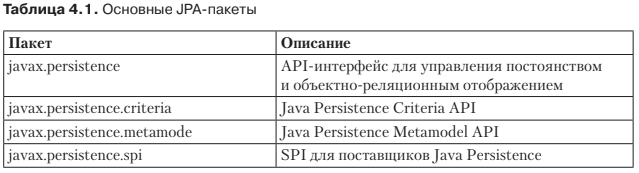

#Обзор спецификации JPA
Версия JPA 1.0 была создана вместе с Java EE 5 для решения проблемы обеспе-
чения постоянства данных. Она объединила объектно-ориентированные и реля-
ционные модели. В Java EE 7 версия JPA 2.1 идет тем же путем простоты и на-
дежности, привнося при этом новую функциональность. Вы можете использовать
этот API-интерфейс для доступа к реляционным данным Enterprise JavaBeans,
веб-компонентам и приложениям Java SE и манипулирования ими.
JPA — это абстракция над JDBC, которая дает возможность быть независимым
от SQL. Все классы и аннотации этого API-интерфейса располагаются в пакете
* javax.persistence. 

Рассмотрим основные компоненты JPA.
* Объектно-реляционное отображение, которое представляет собой механизм
отображения объектов в данные, хранящиеся в реляционной базе данных.
* API менеджера сущностей для осуществления операций, связанных с базами
данных, например CRUD-операций.
* JPQL, который позволяет вам извлекать данные с помощью объектно-ориен-
тированного языка запросов.
* Транзакции имеханизмы блокировки, которые предусматривает Java Transaction
API (JTA) при одновременном доступе к данным. JPA также поддерживает
ресурсные локальные (не-JTA) транзакции.
* Обратные вызовы и слушатели для добавления бизнес-логики в жизненный
цикл того или иного постоянного объекта.
* Генерирование схем — JPA 2.1 включает механизм генерирования стандарти-
зированных схем баз данных, привнося новый API-интерфейс и набор свойств
(которые определяются в файле persistence.xml).
* Преобразователи — новые классы, которые обеспечивают преобразование
между представлениями баз данных и атрибутов.
* Поддержка CDI — теперь можно внедрять зависимости в слушатели событий.
* Поддержка хранимых процедур — JPA 2.1 позволяет выполнять динамически
генерируемые и именованные запросы к хранимым процедурам.
* Запросы с использованием критериев на пакетное обновление и удаление —
Criteria API позволял выполнять только запросы на выборку; теперь стали
возможны запросы на обновление и удаление.
* Понижающее приведение — новый оператор TREAT обеспечивает доступ к специ-
фичному для подклассов состоянию в запросах.

  