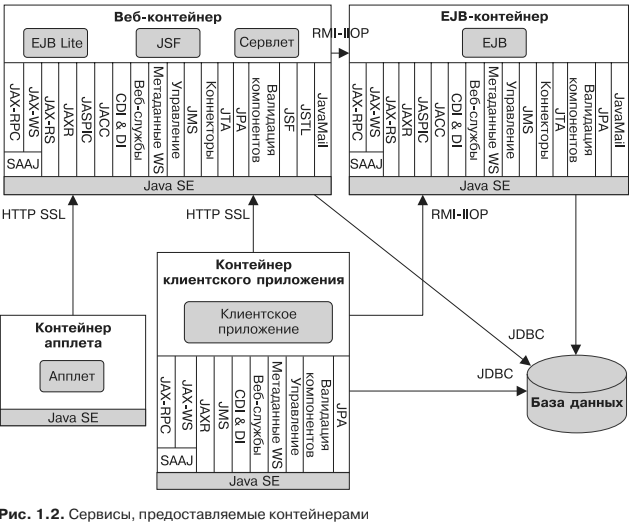

# Сетевые протоколы

* HTTP — веб-протокол, повсеместно используемый в современных приложени-
ях. В Java SE клиентский API определяется пакетом java.net. Серверный API
для работы с HTTP определяется сервлетами, JSP-страницами, интерфейсами
JSF, а также веб-службами SOAP и RESTful.

* HTTPS — представляет собой комбинацию HTTP и протокола безопасных со-
единений SSL.

* RMI-IIOP — удаленный вызов методов (RMI) позволяет вызывать удаленные
объекты независимо от основного протокола. ВJavaSE нативным RMI-протоколом
является протокол Java для удаленного вызова методов (JMRP). RMI-IIOP пред-
ставляет собой расширение технологии RMI, которое используется для интегра-
ции с архитектурой CORBA. Язык описания Java-интерфейсов (IDL) позволяет
компонентам приложений Java EE вызывать внешние объекты CORBA с помо-
щью протокола IIOP. Объекты CORBA могут быть написаны на разных языках
(Ada, C, C++, Cobol и т. д.), включая Java.

