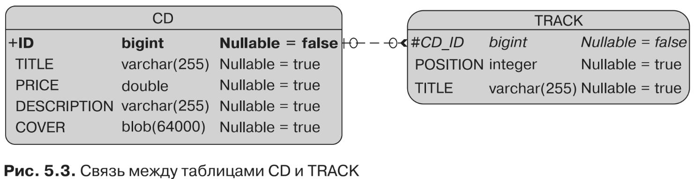

#Отображение базовых типов
Как и коллекции, отображения очень полезны при сохранении данных. В JPA 1.0
ключи могли относиться только к базовому типу данных, а значения могли быть
только сущностями. Сейчас отображения могут содержать любую комбинацию
базовых типов, встраиваемых объектов и сущностей как ключей или значений, что
привносит большую гибкость в процесс отображения. Сосредоточимся на отобра-
жениях базовых типов.

Когда отображение задействует базовые типы, аннотации @ElementCollection
и @CollectionTable могут быть использованы тем же путем, который вы видели
ранее в случае с коллекциями. Таблица коллекции тогда будет использоваться для
хранения данных отображения.

Обратимся к примеру с CD-альбомом, содержащим треки (листинг 5.25). Трек
имеет название и позицию (первый трек альбома, второй трек альбома и т. д.).
Тогда у вас может быть отображение треков с целочисленным значением, говорящем
о позиции определенного трека (ключ отображения), и строкой для указания на-
звания этого трека (значение отображения).
```xml
@Entity
public class CD {
    @Id @GeneratedValue
    private Long id;
    private String title;
    private Float price;
    private String description;
    @Lob
    private byte[] cover;
    @ElementCollection
    @CollectionTable(name="track")
    @MapKeyColumn (name = "position")
    @Column(name = "title")
    private Map<Integer, String> tracks = new HashMap<>();
// Конструкторы, геттеры, сеттеры
}
```
Я уже говорил, что аннотация @ElementCollection используется как индикатор
объектов в отображении, хранящихся в таблице коллекции. Аннотация @Col-
lectionTable изменяет имя по умолчанию таблицы коллекции на TRACK.

Разница в случае с коллекциями заключается во введении новой аннотации: @Map-
KeyColumn. Она используется для указания отображения ключевого столбца. Если она
не будет задана, то столбец получит имя в виде конкатенации имени ссылающегося
атрибута связи и _KEY. В листинге 5.25 видно, что аннотация переименовала его
в POSITION, чтобы было яснее, а по умолчанию он назывался бы иначе (TRACK_KEY).

Аннотация @Column указывает на то, что столбец, содержащий значение отобра-
жения, следует переименовать в TITLE. Результат можно увидеть на рис. 5.3.
