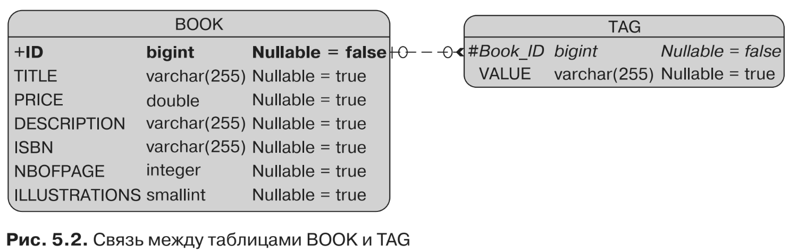

#Коллекции базовых типов
Коллекции тех или иных элементов очень распространены в Java. Из последующих
разделов вы узнаете о связях между сущностями (которые могут быть коллекция-
ми сущностей). По сути, это означает, что у одной сущности имеется коллекция
других сущностей или встраиваемых объектов. Что касается отображения, то каж-
дая сущность отображается в свою таблицу, при этом создаются ссылки между
первичными и внешними ключами. Как вы уже знаете, сущность представляет со-
бой Java-класс с идентификатором и множеством других атрибутов. Но что, если
вам потребуется сохранить коллекцию Java-типов, например String или Integer?
С тех пор как вышла версия JPA 2.0, это можно легко сделать без необходимости
решать проблему создания отдельного класса. Для этого предназначены аннотации
* @ElementCollection
* @CollectionTable

Мы используем аннотацию @ElementCollection как индикатор того, что атрибут
типа java.util.Collection включает коллекцию экземпляров базовых типов (то есть
объектов, которые не являются сущностями) или встраиваемых объектов (по-
дробнее на эту тему мы поговорим в разделе «Встраиваемые объекты»). Фактически
этот атрибут может иметь один из следующих типов:
* java.util.Collection — общий корневой интерфейс в иерархии коллекций;
* java.util.Set — коллекция, предотвращающая вставку элементов-дубликатов;
* java.util.List — коллекция, которая применяется, когда требуется извлечь
  элементы в некоем порядке, определяемом пользователем.

Кроме того, аннотация @CollectionTable позволяет вам настраивать детали та-
блицы коллекции (то есть таблицы, которая будет соединять таблицу сущности
с таблицей базовых типов), например изменять ее имя. При отсутствии этой анно-
тации имя таблицы будет конкатенацией имени содержащей сущности и имени
атрибута коллекции, разделенных знаком подчеркивания.

Опять-таки, используя сущность-пример Book, взглянем на то, как добавить
атрибут для сохранения тегов. Сегодня теги и облака тегов распространены по-
всеместно. Они обычно применяются при сортировке данных, поэтому представим
в этом примере, что вы хотите добавить как можно больше тегов сущности Book для
ее описания и быстрого поиска. Тег — это всего лишь строка, так что у сущности
Book может быть коллекция строк для сохранения соответствующей информации,
как показано в листинге 5.24.
```xml
@Entity
public class Book {
    @Id @GeneratedValue
    private Long id;
    private String title;
    private Float price;
    private String description;
    private String isbn;
    private Integer nbOfPage;
    private Boolean illustrations;
    @ElementCollection(fetch = FetchType.LAZY)
    @CollectionTable(name = "Tag")
    @Column(name = "Value")
    private List<String> tags = new ArrayList<>();
// Конструкторы, геттеры, сеттеры
}
```

Аннотация @ElementCollection, показанная в листинге 5.24, используется для ин-
формирования поставщика постоянства о том, что атрибут tags представляет собой
список строк, а его выборка должна быть отложенной. При отсутствии @CollectionTable
имя таблицы по умолчанию было бы BOOK_TAGS (конкатенация имени содержащей
сущности и имени атрибута коллекции, разделенных знаком подчеркивания), а не
TAG, как указано в элементе name (name = "Tag"). Обратите внимание, что я добавил
дополнительную аннотацию @Column, чтобы переименовать столбец в VALUE (в про-
тивном случае этот столбец получил бы имя, как у атрибута, TAGS). Результат можно
увидеть на рис. 5.2.

