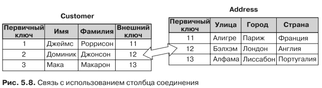
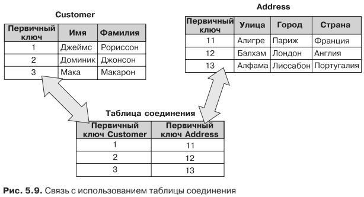

#Связи в реляционных базах данных
В реляционном мире дело обстоит по-другому, поскольку, строго говоря, реляци-
онная база данных — это коллекция отношений (также называемых таблицами),
то есть все, что вы смоделируете, будет таблицей. При моделировании ассоциации
у вас не будет списков, наборов или отображений — у вас будут таблицы. В JPA
при наличии ассоциации между одним классом и другим в базе данных у вас будет
ссылка на таблицу. Эту ссылку можно смоделировать двумя способами: с помощью
внешнего ключа (столбца соединения) или с использованием таблицы соединения.
В контексте базы данных столбец, ссылающийся на ключ другой таблицы, называ-
ется столбцом внешнего ключа.

В качестве примера предположим, что у клиента имеется один домашний адрес.
В листингах 5.33 и 5.34 мы моделировали эту связь как встраиваемый объект, од-
нако теперь превратим ее в связь «один к одному». При использовании Java у вас
имелся бы класс Customer с атрибутом Address. В реляционном мире у вас могла бы
быть таблица CUSTOMER, указывающая на ADDRESS с помощью столбца внешнего клю-
ча (или столбца соединения), как показано на рис. 5.8.

Есть и второй способ моделирования — с применением таблицы соединения.
В таблице CUSTOMER, показанной на рис. 5.9, больше нет внешнего ключа ADDRESS. Для
размещения информации о связи с сохранением внешних ключей была создана
промежуточная таблица.

Вы не стали бы использовать таблицу соединения для представления связи «один
к одному», поскольку это могло бы отрицательно сказаться на производительности
(вам всегда будет нужен доступ к третьей таблице для получения адреса клиента).

Таблицы соединения обычно применяются при наличии кардинальностей «один
ко многим» или «многие ко многим». Как вы увидите в следующем разделе, JPA
использует два режима для отображения объектных ассоциаций.