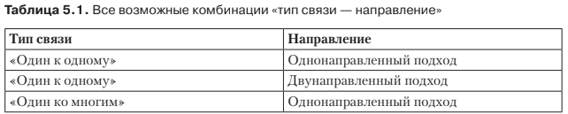
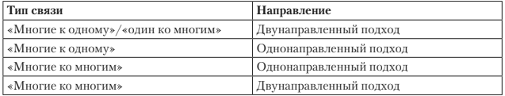

#Связи между сущностями
Между двумя сущностями могут быть отношения «один к одному», «один ко
многим», «многие к одному» или «многие ко многим». Каждое соответствующее
отображение именуется согласно типу связи источника и цели: аннотации 
* @OneToOne,
* @OneToMany, 
* @ManyToOne
* @ManyToMany. 

Каждая аннотация может быть использована
однонаправленным или двунаправленным путем. В табл. 5.1 приведены все воз-
можные комбинации типов связи и направлений.

Вы увидите, что названные подходы являются повторяющимися концепциями,
которые применимы одинаковым образом ко всем типам связи. Далее вы узнаете,
в чем заключается разница между однонаправленными и двунаправленными свя-
зями, а затем реализуете некоторые из соответствующих комбинаций. Я не стану
подробно разбирать весь перечень комбинаций, а сосредоточусь на одном подмно-
жестве. Объяснение всех комбинаций было бы повторением одного и того же.
Важно, чтобы вы поняли, как отображать отношение и направление в связях.