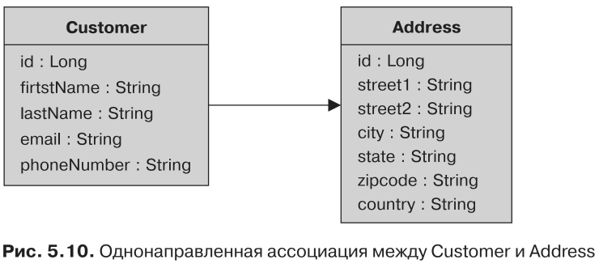
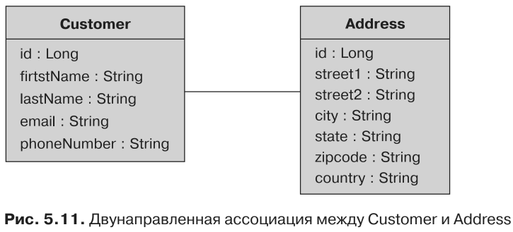
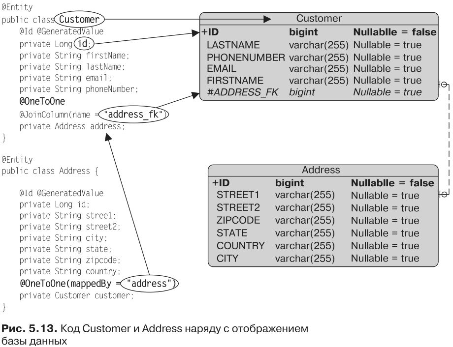

#Однонаправленные и двунаправленные ассоциации
С точки зрения объектного моделирования связь между классами естественна. При
однонаправленной ассоциации объект А указывает только на объект В; при двуна-
правленной ассоциации оба объекта ссылаются друг на друга. Однако потребуется
приложить усилия, когда речь зайдет об отображении двунаправленной связи
в реляционную базу данных, как показано в следующем примере, включающем
клиента, у которого имеется домашний адрес.

При однонаправленной связи у сущности Customer имеется атрибут типа Address
(рис. 5.10). Эта связь является однонаправленной и предполагает навигацию от
одной стороны к другой. Customer в данном случае называется владельцем связи.
В контексте базы данных это означает, что таблица CUSTOMER будет располагать
внешним ключом (столбцом соединения), указывающим на ADDRESS, а если вы бу-
дете владеть связью, то сможете настроить отображение этой связи. Например, если
вам потребуется изменить имя внешнего ключа, отображение будет выполнено
в сущности Customer (то есть владельце).

Как уже отмечалось, связи также могут быть двунаправленными. Чтобы иметь
возможность осуществлять навигацию между Address и Customer, вам потребуется
преобразовать однонаправленную связь в двунаправленную, добавив атрибут
Customer в сущность Address (рис. 5.11). Обратите внимание, что на UML-диаграммах
классов не приводятся атрибуты, представляющие связь.

Как осуществляется отображение пары однонаправленных связей? Кто является
владельцем двунаправленной связи? Кто владеет информацией об отображении
столбца соединения или таблицы соединения? Если у однонаправленных связей есть
владеющая сторона, то у двунаправленных связей есть как владеющая, так и противо-
положная сторона, которая должна быть указана явным образом с помощью элемен-
та 
* mappedBy аннотаций @OneToOne, @OneToMany и @ManyToMany. 

Элемент mappedBy идентифицирует атрибут, который владеет связью и необходим для двунаправленных связей.

Для пояснения сравним Java-код (с одной стороны) и отображение базы данных
(с другой стороны). Как вы можете видеть в левой части рис. 5.13, обе сущности
указывают друг на друга с помощью атрибутов: у Customer имеется атрибут, анно-
тированный с использованием @OneToOne, а у сущности Address — атрибут Customer,
тоже снабженный аннотацией. В правой части располагается отображение базы
данных, где показаны таблицы CUSTOMER и ADDRESS. CUSTOMER является владельцем
связи, поскольку содержит внешний ключ ADDRESS.

На рис. 5.13 в аннотации @OneToOne сущности Address используется элемент
mappedBy. Address в данном случае именуется противоположным владельцем связи,
поскольку обладает элементом mappedBy. Элемент mappedBy говорит о том, что стол-
бец соединения (address) указан на другом конце связи. Кроме того, на другом
конце связи сущность Customer определяет столбец соединения путем использова-
ния аннотации @JoinColumn и переименовывает внешний ключ в address_fk. Сущность
Customer представляет собой владеющую сторону связи и, как владелец, должна
определять отображение столбца соединения. Address выступает в качестве проти-
воположной стороны связи, где таблица владеющей сущности содержит внешний
ключ (таблица CUSTOMER включает столбец ADDRESS_FK).

Элемент mappedBy может присутствовать в аннотациях @OneToOne, @OneToMany
и @ManyToMany, но не в @ManyToOne. Атрибут mappedBy не может быть сразу на обеих
сторонах двунаправленной ассоциации. Было бы также неправильно, если бы
его не было ни на одной из сторон, поскольку поставщик воспринимал бы все
это как две независимые однонаправленные связи. Это подразумевало бы, что
каждая из сторон является владельцем и может определять столбец соедине-
ния.