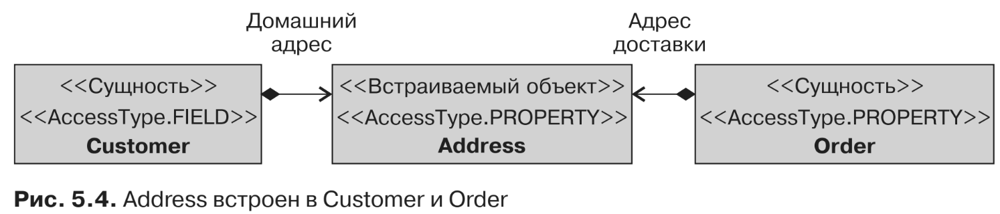

#Встраиваемые объекты

В приводившемся ранее в этой главе подразделе «Составные первичные ключи» вы
видели, как класс может быть встроен и использован в качестве первичного ключа
с применением аннотации @EmbeddedId. Встраиваемые объекты — это объекты, которые
сами по себе не имеют постоянного идентификатора; они могут быть только встроены
во владеющие сущности. Владеющая сущность может располагать коллекциями
встраиваемых объектов, а также одним встраиваемым атрибутом. Они сохраняются как
внутренняя часть владеющей сущности и совместно используют идентификатор этой
сущности. Это означает, что каждый атрибут встроенного объекта будет отображаться
в таблицу сущности. Это связь строгого владения (также называемая композицией),
поэтому если удалить сущность, то встроенные объекты тоже окажутся удалены.

Эта композиция между двумя классами задействует аннотации. Для включен-
ного класса используется аннотация @Embeddable, в то время как в отношении сущ-
ности, которая включает этот класс, используется @Embedded. Обратимся к примеру
клиента, у которого имеется идентификатор, имя, адрес электронной почты, а так-
же домашний адрес. Все соответствующие атрибуты могли бы располагаться
в одной сущности Customer (листинг 5.31), однако по причинам объектного моде-
лирования они разделены на два класса: Customer и Address. Поскольку у Address нет
собственного идентификатора, и при этом он всего лишь часть состояния Customer,
этот класс является хорошим кандидатом на то, чтобы стать встраиваемым объ-
ектом вместо сущности (листинг 5.30).
```xml
@Embeddable
public class Address {
    private String street1;
    private String street2;
    private String city;
    private String state;
    private String zipcode;
    private String country;
// Конструкторы, геттеры, сеттеры
}
```
Как вы можете видеть в листинге 5.30, класс Address аннотирован не как сущ-
ность, а как встраиваемый объект. Аннотация @Embeddable определяет, что Address
может быть встроен в иной класс-сущность (или иной встраиваемый объект).
С другой стороны, для сущности Customer приходится использовать аннотацию
@Embedded, чтобы определить, что Address является постоянным атрибутом, который
будет сохранен как внутренняя часть и станет совместно использовать его иденти-
фикатор (см. листинг 5.31).
```xml
@Entity
public class Customer {
    @Id @GeneratedValue
    private Long id;
    private String firstName;
    private String lastName;
    private String email;
    private String phoneNumber;
    @Embedded
    private Address address;
// Конструкторы, геттеры, сеттеры
}
```
Каждый атрибут Address будет отображаться в таблицу владеющей сущности
Customer. Будет только одна таблица со структурой, определенной в листинге 5.32.
Как вы увидите позднее в подразделе «Переопределение атрибутов» раздела «Ото-
бражение наследования» данной главы, сущности могут переопределять атрибуты
встраиваемых объектов (с использованием аннотации @AttributeOverrides).
```xml
create table CUSTOMER (
ID BIGINT not null,
LASTNAME VARCHAR(255),
PHONENUMBER VARCHAR(255),
EMAIL VARCHAR(255),
FIRSTNAME VARCHAR(255),
STREET2 VARCHAR(255),
STREET1 VARCHAR(255),
ZIPCODE VARCHAR(255),
STATE VARCHAR(255),
COUNTRY VARCHAR(255),
CITY VARCHAR(255),
primary key (ID)
);
```

Тип доступа встраиваемого класса. 

Тип доступа встраиваемого класса обуслав-
ливается типом доступа класса-сущности, в котором он располагается. Если сущность
явным образом использует такой тип доступа, как доступ к свойствам, то встраива-
емый объект будет неявно использовать аналогичный тип доступа. Другой тип до-
ступа для встраиваемого класса можно указать с помощью аннотации @Access.
Сущности Customer (листинг 5.33) и Address (листинг 5.34) задействуют разные
типы доступа.
```xml
@Entity
@Access(AccessType.FIELD)
public class Customer {
    @Id @GeneratedValue
    private Long id;
    @Column(name = "first_name", nullable = false, length = 50)
    private String firstName;
    @Column(name = "last_name", nullable = false, length = 50)
    private String lastName;
    private String email;
    @Column(name = "phone_number", length = 15)
    private String phoneNumber;
    @Embedded
    private Address address;
// Конструкторы, геттеры, сеттеры
}
```
```xml
@Embeddable
@Access(AccessType.PROPERTY)
public class Address {
    private String street1;
    private String street2;
    private String city;
    private String state;
    private String zipcode;
    private String country;
    // Конструкторы
    @Column(nullable = false)
    public String getStreet1() {
        return street1;
    }
    public void setStreet1(String street1) {
        this.street1 = street1;
    }
    public String getStreet2() {
        return street2;
    }
    public void setStreet2(String street2) {
        this.street2 = street2;
    }
    @Column(nullable = false, length = 50)
    public String getCity() {
        return city;
    }
    public void setCity(String city) {
        this.city = city;
    }
    @Column(length = 3)
    public String getState() {
        return state;
    }
    public void setState(String state) {
        this.state = state;
    }
    @Column(name = "zip_code", length = 10)
    public String getZipcode() {
        return zipcode;
    }
    public void setZipcode(String zipcode) {
        this.zipcode = zipcode;
    }
    public String getCountry() {
        return country;
    }
    public void setCountry(String country) {
        this.country = country;
    }
}
```
Настоятельно рекомендуется явным образом задавать тип доступа для встраи-
ваемых объектов, чтобы избежать ошибок отображения, когда один встраиваемый
объект окажется встроенным во множественные сущности. К примеру, расширим
нашу модель, добавив сущность Order, как показано на рис. 5.4. Address теперь будет
встроен в Customer и Order.


Для каждой сущности определяется отличающийся тип доступа: Customer ис-
пользует доступ к полям, а Order — доступ к свойствам. Поскольку тип доступа
встраиваемого объекта обуславливается типом доступа класса-сущности, в котором
он объявлен, Address будет отображен двумя разными путями, что может привести
к проблемам отображения. Чтобы этого не случилось, тип доступа Address должен
быть задан явным образом.
