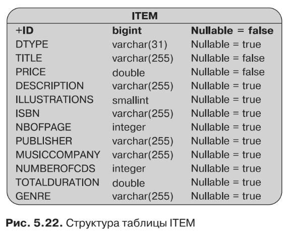
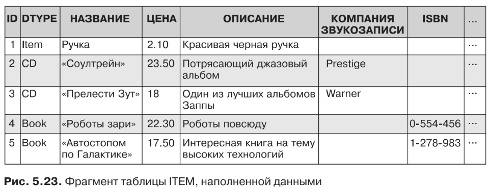
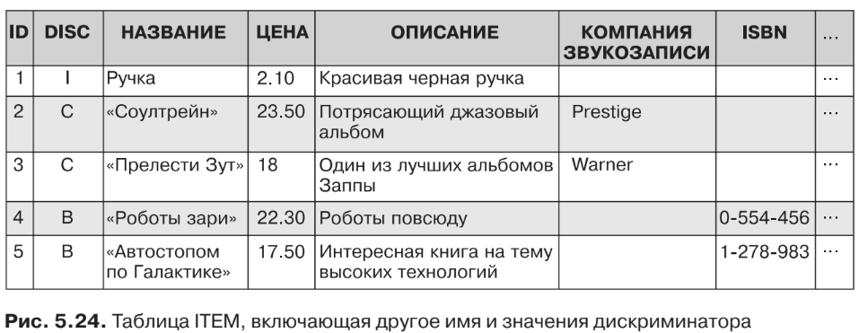

#Иерархическая стратегия «одна таблица на класс»

По умолчанию используется стратегия отображения наследования «одна таблица
на класс». При ней все сущности в иерархии отображаются в одну таблицу. По-
скольку она применяется по умолчанию, вы можете вообще не использовать анно-
тацию @Inheritance в сочетании с корневой сущностью (благодаря конфигурации
в порядке исключения), что и было сделано с сущностью Item (листинг 5.54).
```xml
@Entity
public class Item {
    @Id @GeneratedValue
    protected Long id;
    protected String title;
    protected Float price;
    protected String description;
// Конструкторы, геттеры, сеттеры
}
```

Item (см. листинг 5.54) является корневой по отношению к сущностям Book
(листинг 5.55) и CD (листинг 5.56). Эти сущности наследуют атрибуты от Item,
а также используемую по умолчанию стратегию наследования, поэтому нет нужды
в аннотации @Inheritance.
```xml
@Entity
public class Book extends Item {
    private String isbn;
    private String publisher;
    private Integer nbOfPage;
    private Boolean illustrations;
// Конструкторы, геттеры, сеттеры
}
```
```xml
@Entity
public class CD extends Item {
    private String musicCompany;
    private Integer numberOfCDs;
    private Float totalDuration;
    private String genre;
// Конструкторы, геттеры, сеттеры
}
```
Учитывая то, что вы видели до настоящего момента, без наследования эти три
сущности были бы отображены в их собственные отдельные таблицы, однако с на-
следованием все будет по-другому. При использовании стратегии «одна таблица
на класс» все они окажутся в одной и той же таблице базы данных, имя которой по
умолчанию будет совпадать с именем корневого класса — ITEM. Ее структура по-
казана на рис. 5.22.



Как вы можете видеть на рис. 5.22, в таблице ITEM собраны все атрибуты сущ-
ностей Item, Book и CD. Однако есть дополнительный столбец, который не относится
к атрибутам какой-либо из этих сущностей — это столбец дискриминатора DTYPE.

Таблица ITEM будет наполнена информацией, касающейся элементов, книг и CD-
альбомов. При доступе к данным поставщику постоянства потребуется знать, какая
строка к какой сущности относится. Таким образом, поставщик создаст экземпляр
соответствующего типа объекта (Item, Book или CD) при чтении таблицы ITEM. Вот
почему столбец дискриминатора используется для того, чтобы явным образом
указать тип в каждой строке.

На рис. 5.23 показан фрагмент таблицы ITEM с данными. Как вы можете видеть,
в стратегии «одна таблица на класс» имеются некоторые бреши; не каждый столбец
подходит для любой из сущностей. В первой строке располагаются данные, каса-
ющиеся сущности Item (имя этой сущности содержится в столбце DTYPE). В случае
с Item в таблице имеется только название, цена и описание (см. листинг 5.53), при
этом отсутствует название компании звукозаписи, ISBN-номер и т. д. Поэтому со-
ответствующие столбцы всегда будут оставаться пустыми.



Столбец дискриминатора по умолчанию имеет имя DTYPE, тип String (отобра-
жаемый в VARCHAR) и содержит имя сущности. Если используемые по умолчанию
значения окажутся неподходящими, то аннотация 
* @DiscriminatorColumn

позволит вам изменить имя и тип данных. По умолчанию значением этого столбца является
имя сущности, на которую он ссылается, однако сущность может переопределить
это значение благодаря аннотации @DiscriminatorValue.

В листинге 5.57 столбец дискриминатора переименовывается в DISC (вместо
DTYPE), а также изменяется его тип данных с String на Char. Тогда значение дискри-
минатора каждой из сущностей должно измениться соответственно с Item на I, с Book
на B (листинг 5.58) и с CD на C (листинг 5.59).
```xml
@Entity
@Inheritance(strategy = InheritanceType.SINGLE_TABLE)
@DiscriminatorColumn (name="disc",
        discriminatorType = DiscriminatorType.CHAR)
```
```xml
@DiscriminatorValue("I")
public class Item {
    @Id @GeneratedValue
    protected Long id;
    protected String title;
    protected Float price;
    protected String description;
// Конструкторы, геттеры, сеттеры
}
```
```xml
@DiscriminatorValue("B")
public class Book extends Item {
    private String isbn;
    private String publisher;
    private Integer nbOfPage;
    private Boolean illustrations;
// Конструкторы, геттеры, сеттеры
}
```
```xml
@DiscriminatorValue("C")
public class CD extends Item {
    private String musicCompany;
    private Integer numberOfCDs;
    private Float totalDuration;
    private String genre;
// Конструкторы, геттеры, сеттеры
}
```
Корневая сущность Item один раз определяет столбец дискриминатора для
иерархии сущностей с использованием @DiscriminatorColumn. Затем она изменяет
свое значение по умолчанию на I благодаря @DiscriminatorValue. Дочерним сущ-
ностям требуется переопределить только собственное значение дискриминатора.



Стратегия «одна таблица на класс» является самой легкой для понимания и хо-
рошо работает, когда иерархия относительно проста и стабильна. Однако у нее
имеются кое-какие недостатки: добавление новых сущностей в иерархию или
атрибутов в уже существующие сущности влечет добавление новых столбцов в та-
блицу, миграцию данных и изменение индексов. Эта стратегия также требует,
чтобы столбцы дочерних сущностей допускали значение null. Если столбец сущ-
ности Book, содержащий ISBN-номер, не окажется таковым, то вы больше не смо-
жете вставлять данные, которые относятся к CD-альбомам, поскольку для сущ-
ности CD отсутствует значение такого столбца.


