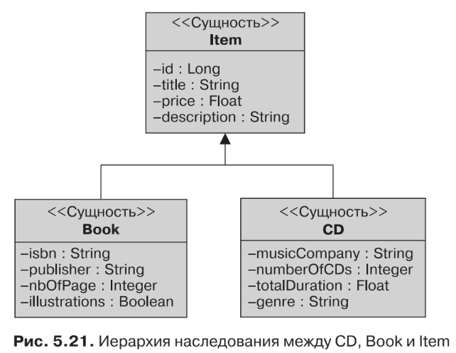

#Стратегии наследования

В том, что касается отображения наследования, JPA поддерживает три разные
стратегии. При наличии иерархии сущностей одна из них всегда выступает в каче-
стве корневой. Класс корневой сущности может определить стратегию наследова-
ния, используя элемент strategy аннотации @Inheritance, согласно одному из вари-
антов, определенных в перечислимом типе javax.persistence.InheritanceType.
В противном случае будет задействована иерархическая стратегия по умолчанию
«одна таблица на класс». Чтобы исследовать каждую стратегию, я расскажу вам
о том, как отобразить сущности CD и Book, которые наследуют от сущности Item
(рис. 5.21).

Сущность Item является корневой и содержит атрибуты id, title, description
и price. Обе сущности — CD и Book — наследуют от Item. Каждый из этих листовых
классов привносит дополнительные атрибуты, например isbn в случае с сущностью
Book или totalDuration, если вести речь о сущности CD.