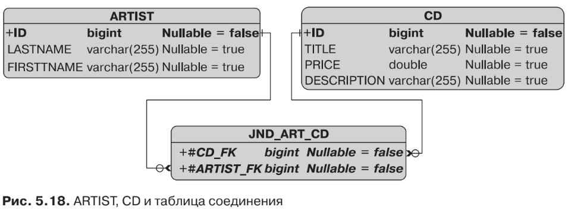

#Двунаправленная связь с использованием @ManyToMany
Двунаправленная связь «многие ко многим» имеет место, когда один объект-
источник ссылается на много целей и когда цель ссылается на много источников.
Например, CD-альбом создается несколькими артистами, а один артист принима-
ет участие в создании нескольких CD-альбомов. В мире Java у каждой сущности
будет коллекция целевых сущностей. В реляционном мире единственный способ
отобразить связь «многие ко многим» — использовать таблицу соединения (стол-
бец соединения не поможет). Кроме того, как вы уже видели ранее, при двунаправ-
ленной связи вам потребуется явным образом определить владельца (с помощью
элемента mappedBy).

Если исходить из того, что сущность Artist является владельцем связи, то это
будет означать, что противоположным владельцем (листинг 5.47) выступает сущ-
ность CD, которой необходимо, чтобы элемент mappedBy был использован в сочетании
с ее аннотацией @ManyToMany. Элемент mappedBy сообщит поставщику постоянства о том,
что appearsOnCDs — это имя соответствующего атрибута владеющей сущности.
```xml
@Entity
public class CD {
    @Id @GeneratedValue
    private Long id;
    private String title;
    private Float price;
    private String description;
    @ManyToMany(mappedBy = "appearsOnCDs")
    private List<Artist> createdByArtists;
// Конструкторы, геттеры, сеттеры
}
```
Таким образом, если сущность Artist является владельцем связи, как показано
в листинге 5.48, то она будет использоваться для настройки отображения таблицы
соединения посредством аннотаций @JoinTable и @JoinColumn.
```xml
@Entity
public class Artist {
    @Id @GeneratedValue
    private Long id;
    private String firstName;
    private String lastName;
    @ManyToMany
    @JoinTable(name = "jnd_art_cd",
            joinColumns = @JoinColumn(name = "artist_fk"),
            inverseJoinColumns = @JoinColumn(name = "cd_fk"))
    private List<CD>appearsOnCDs;
// Конструкторы, геттеры, сеттеры
}
```
Как вы можете видеть в листинге 5.48, таблица соединения между Artist и CD
переименовывается в JND_ART_CD, как и каждый столбец соединения (благодаря
аннотации @JoinTable). Элемент joinColumns ссылается на владеющую сторону
(Artist), а inverseJoinColumns — на противоположную владеющую сторону (CD). Со-
ответствующая структура базы данных показана на рис. 5.18.

Следует отметить, что при двунаправленной связи «многие ко многим» и «один
к одному» любая из сторон может быть обозначена как владеющая. Независимо от
того, какая из сторон будет обозначена как владелец, владеющая сторона должна
включать элемент mappedBy. В противном случае поставщик будет считать, что обе
стороны являются владельцами, и воспринимать все это как две отдельные однона-
правленные связи «один ко многим». В результате этого могло бы получиться че-
тыре таблицы: ARTIST и CD плюс две таблицы соединения с именами ARTIST_CD и CD_
ARTIST. И недопустимым было бы наличие mappedBy на обеих сторонах.