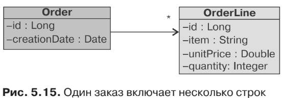
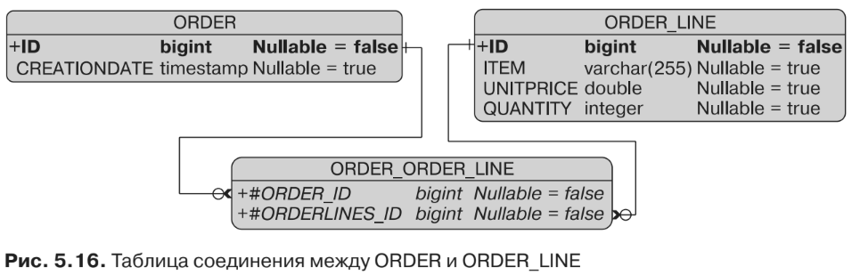
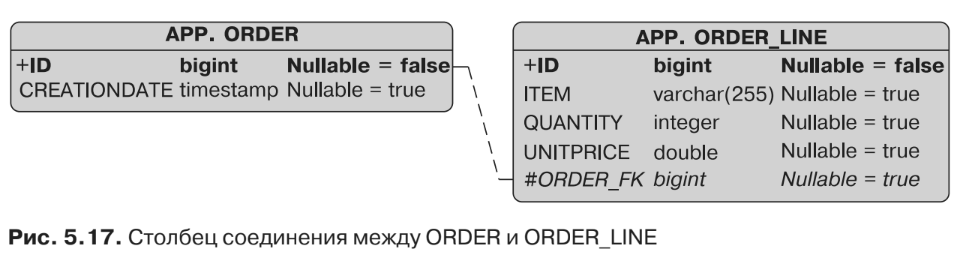

#Однонаправленная связь с использованием @OneToMany
Связь «один ко многим» наблюдается, когда один объект-источник ссылается на
множество объектов-целей. Например, заказ на покупку включает несколько строк
заказа (рис. 5.15). Строка заказа могла бы ссылаться на заказ на покупку с исполь-
зованием аннотации @ManyToOne, однако это не тот случай, поскольку связь являет-
ся однонаправленной. Order — это сторона «одного» и источник связи, а OrderLine —
сторона «многих» и цель.


Отношения являются множественными, а навигация осуществляется только от
Order по направлению к OrderLine. В Java эта множественность характеризуется
интерфейсами Collection, List и Set из пакета java.util. В листинге 5.41 приведен
код сущности Order с однонаправленной связью «один ко многим» относительно
OrderLine (листинг 5.42).
```xml
@Entity
public class Order {
    @Id @GeneratedValue
    private Long id;
    @Temporal(TemporalType.TIMESTAMP)
    private Date creationDate;
    private List<OrderLine> orderLines;
// Конструкторы, геттеры, сеттеры
}
```
```xml
@Entity
@Table(name = "order_line")
public class OrderLine {
    @Id @GeneratedValue
    private Long id;
    private String item;
    private Double unitPrice;
    private Integer quantity;
// Конструкторы, геттеры, сеттеры
}
```
Order из листинга 5.41 не имеет каких-либо специальных аннотаций и опирает-
ся на парадигму «конфигурация в порядке исключения». Тот факт, что коллекция
типа сущности используется как атрибут для этой сущности, по умолчанию ини-
циирует отображение связи «один ко многим». Изначально однонаправленные
связи «один ко многим» задействуют таблицу соединения с двумя столбцами
внешнего ключа для сохранения информации о связях. Один столбец внешнего
ключа будет ссылаться на таблицу ORDER и иметь тот же тип, что и ее первичный
ключ, а другой будет ссылаться на таблицу ORDER_LINE. Имя этой таблицы соедине-
ния будет состоять из имен обеих сущностей, разделенных символом «_». Таблица
соединения получит имя ORDER_ORDER_LINE, а в результате у нас будет схематическая
структура, показанная на рис. 5.16.


Если вам не нравятся имена таблицы соединения и внешнего ключа либо если
вы выполняете отображение в уже существующую таблицу, то можете воспользо-
ваться аннотациями JPA для переопределения этих применяемых по умолчанию
имен. Именем по умолчанию для столбца соединения является конкатенация имени
сущности, символа «_» и имени первичного ключа, на который происходит ссылка.
В то время как аннотация @JoinColumn может быть использована для изменения
столбцов внешнего ключа, аннотация @JoinTable (листинг 5.43) позволяет сделать то
же самое, если речь идет об отображении таблицы соединения. Вы также можете
воспользоваться аннотацией @OneToMany (листинг 5.44), которая, как и @OneToOne, дает
возможность настраивать саму связь (применение режима fetch и т. д.).
```xml
@Target({METHOD, FIELD}) @Retention(RUNTIME)
public @interface JoinTable {
    String name() default "";
    String catalog() default "";
    String schema() default "";
    JoinColumn[] joinColumns() default {};
    JoinColumn[] inverseJoinColumns() default {};
    UniqueConstraint[] uniqueConstraints() default {};
    Index[] indexes() default {};
}
```
```xml
@Entity
public class Order {
    @Id @GeneratedValue
    private Long id;
    @Temporal(TemporalType.TIMESTAMP)
    private Date creationDate;
    @OneToMany
    @JoinTable(name = "jnd_ord_line",
            joinColumns = @JoinColumn(name = "order_fk"),
            inverseJoinColumns = @JoinColumn(name = "order_line_fk") )
    private List<OrderLine> orderLines;
// Конструкторы, геттеры, сеттеры
}
```
В случае с API-интерфейсом аннотации @JoinTable в листинге 5.42 вы можете
видеть два атрибута типа @JoinColumn: joinColumns и inverseJoinColumns. Они разли-
чаются владеющей и противоположной сторонами. Элемент joinColumns характе-
ризует владеющую сторону (владельца связи) и в нашем примере ссылается на
таблицу ORDER. Элемент inverseJoinColumns определяет противоположную сторону,
то есть цель связи, и ссылается на ORDER_LINE.

При использовании сущности Order (листинг 5.44) вы можете добавить аннотации
@OneToMany и @JoinTable для атрибута orderLines, переименовав таблицу соединения
в JND_ORD_LINE (вместо ORDER_ORDER_LINE), а также два столбца внешнего ключа.

Сущность Order из листинга 5.44 будет отображена в таблицу соединения, опи-
санную в листинге 5.45.
```xml
create table JND_ORD_LINE (
ORDER_FK BIGINT not null,
ORDER_LINE_FK BIGINT not null,
primary key (ORDER_FK, ORDER_LINE_FK),
foreign key (ORDER_LINE_FK) references ORDER_LINE(ID),
foreign key (ORDER_FK) references ORDER(ID)
);
```
Правило по умолчанию для однонаправленной связи «один ко многим» — ис-
пользование таблицы соединения, однако его очень легко (и целесообразно, если
речь идет об унаследованных базах данных) изменить таким образом, чтобы при-
менялись внешние ключи. Для сущности Order необходимо предусмотреть аннота-
цию @JoinColumn вместо @JoinTable, что позволит изменить код, как показано в ли-
стинге 5.46.
```xml
@Entity
public class Order {
    @Id @GeneratedValue
    private Long id;
    @Temporal(TemporalType.TIMESTAMP)
    private Date creationDate;
    @OneToMany(fetch = FetchType.EAGER)
    @JoinColumn(name = "order_fk")
    private List<OrderLine> orderLines;
// Конструкторы, геттеры, сеттеры
}
```
Код сущности OrderLine (показанной в листинге 5.46) не изменится. Обратите
внимание, что в листинге 5.46 аннотация @OneToMany переключает режим по умол-
чанию fetch (поменяв LAZY на EAGER). При использовании вами @JoinColumn стратегия
внешнего ключа затем обеспечивает отображение однонаправленной связи. Внеш-
ний ключ переименовывается с помощью аннотации в ORDER_FK и располагается
в целевой таблице (ORDER_LINE). В результате получается структура базы данных,
показанная на рис. 5.17. Таблица соединения отсутствует, а ссылка между обеими
таблицами осуществляется по внешнему ключу ORDER_FK.
