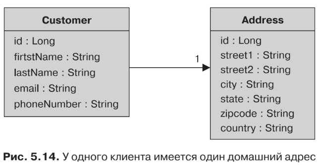

#Однонаправленная связь с использованием @OneToOne
Однонаправленная связь «один к одному» между сущностями имеет ссылку кар-
динальности 1, которая досягаема только в одном направлении. Обратившись к при-
меру клиента и его домашнего адреса, предположим, что у него имеется только один
домашний адрес (кардинальность 1). Важно выполнить навигацию от Customer (ис-
точник) по направлению к Address (цель), чтобы узнать, где клиент живет. Однако
по некоторым причинам при нашей модели, показанной на рис. 5.14, вам не потре-
буется возможность навигации в противоположном направлении (например, вам
не будет нужно знать, какой клиент живет по определенному адресу).


В Java однонаправленная связь означает, что у Customer будет иметься атрибут
Address (листинг 5.35), однако у Address не будет атрибута Customer (листинг 5.36).
```xml
@Entity
public class Customer {
    @Id @GeneratedValue
    private Long id;
    private String firstName;
    private String lastName;
    private String email;
    private String phoneNumber;
    private Address address;
// Конструкторы, геттеры, сеттеры
}
```
```xml
@Entity
public class Address {
    @Id @GeneratedValue
    private Long id;
    private String street1;
    private String street2;
    private String city;
    private String state;
    private String zipcode;
    private String country;
// Конструкторы, геттеры, сеттеры
}
```
Как вы можете видеть в листингах 5.35 и 5.36, эти две сущности снабжены мини-
мально необходимыми нотациями: @Entity с @Id и @GeneratedValue для первичного
ключа и все. При использовании конфигурации в порядке исключения поставщик
постоянства отобразит эти две сущности в две таблицы, а также внешний ключ для
связи (из customer, указывающего на address). Отображение «один к одному» ини-
циируется тем фактом, что Address является объявленной сущностью и включает
сущность Customer как атрибут. Мы автоматически предполагаем связь, используя
одну сущность как свойство другой, поэтому нам не нужна аннотация @OneToOne, по-
скольку она опирается на правила по умолчанию (листинги 5.37 и 5.38).
```xml
create table CUSTOMER (
ID BIGINT not null,
FIRSTNAME VARCHAR(255),
LASTNAME VARCHAR(255),
EMAIL VARCHAR(255),
PHONENUMBER VARCHAR(255),
ADDRESS_ID BIGINT,
primary key (ID),
foreign key (ADDRESS_ID) references ADDRESS(ID)
);
```
```xml
create table ADDRESS (
ID BIGINT not null,
STREET1 VARCHAR(255),
STREET2 VARCHAR(255),
CITY VARCHAR(255),
STATE VARCHAR(255),
ZIPCODE VARCHAR(255),
COUNTRY VARCHAR(255),
primary key (ID)
);
```
Как вы уже знаете, при использовании JPA, если не аннотировать атрибут, будут
применены правила отображения по умолчанию. Таким образом, изначально внеш-
ний ключ будет носить имя ADDRESS_ID (листинг 5.37), которое представляет собой
конкатенацию имени атрибута связи (здесь это address), символа «_» и имени
столбца первичного ключа целевой таблицы (здесь им будет идентификатор столб-
ца таблицы ADDRESS). Обратите также внимание, что в DDL-коде столбец ADDRESS_ID
по умолчанию является nullable, а это означает, что ассоциация «один к одному»
отображается в нуль (значение null) или единицу.

Для настройки отображения вы можете использовать две аннотации. Первая —
@OneToOne (поскольку кардинальность отношения равна единице). Она позволяет
модифицировать отдельные атрибуты ассоциации как таковой, например, подход,
посредством которого должна осуществляться ее выборка. В листинге 5.39 опреде-
лен API-интерфейс аннотации @OneToOne.
```xml
@Target({METHOD, FIELD}) @Retention(RUNTIME)
public @interface OneToOne {
    Class targetEntity() default void.class;
    CascadeType[] cascade() default {};
    FetchType fetch() default EAGER;
    boolean optional() default true;
    String mappedBy() default "";
    boolean orphanRemoval() default false;
}
```
Второй аннотацией является @JoinColumn (ее API-интерфейс очень схож
с API-интерфейсом аннотации @Column из листинга 5.12). Она используется для
настройки столбца соединения, то есть внешнего ключа владеющей стороны.
В листинге 5.40 показано, как вы применили бы две эти аннотации.
```xml
@Entity
public class Customer {
    @Id @GeneratedValue
    private Long id;
    private String firstName;
    private String lastName;
    private String email;
    private String phoneNumber;
    @OneToOne (fetch = FetchType.LAZY)
    @JoinColumn(name = "add_fk", nullable = false)
    private Address address;
// Конструкторы, геттеры, сеттеры
}
```
В JPA внешний ключ называется столбцом соединения. Аннотация @JoinColumn
позволяет вам настраивать отображение внешнего ключа. В листинге 5.40 она ис-
пользуется для переименования столбца внешнего ключа в ADD_FK, а также для того,
чтобы сделать связь обязательной, отклонив значение null (nullable=false). Анно-
тация @OneToOne подсказывает поставщику постоянства о том, что выборка связи
должна быть отложенной (подробнее об этом мы поговорим позднее).