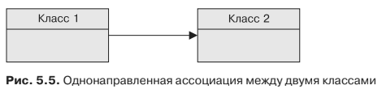
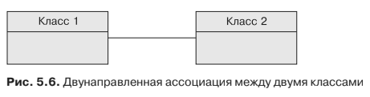
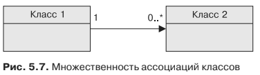

#Отображение связей
Прежде всего, у ассоциации есть направление. Она может быть

* однонаправленной 
(один объект может осуществлять навигацию по направлению к другому объ-
екту)
* двунаправленной (один объект может осуществлять навигацию по направ-
лению к другому и наоборот). 

В Java для навигации по объектам используется
точечный (.) синтаксис. Например, если написать customer.getAddress().getCountry(),
то будет осуществляться навигация от объекта Customer к объекту Address, а затем —
к объекту Country.

В унифицированном языке моделирования (Unified Modeling Language — UML)
для представления однонаправленной ассоциации между двумя классами исполь-
зуется стрелка, указывающая направление. На рис. 5.5 Class1 (источник) может
осуществлять навигацию по направлению к Class2 (цель), но не наоборот.

Для индикации двунаправленной ассоциации стрелки не используются. Как
показано на рис. 5.6, Class1 может осуществлять навигацию по направлению к Class2
и наоборот. В Java это представляется как наличие у Class1 атрибута типа Class2
и наличие у Class2 атрибута типа Class1.

Для ассоциации также характерна множественность (или кардинальность).
На каждом из концов ассоциации можно указать, сколько ссылающихся объектов
вовлечено в нее. На UML-диаграмме, приведенной на рис. 5.7, показано, что Class1
ссылается на нуль или более экземпляров Class2.

В UML кардинальность — это диапазон между минимальным и максимальным
числами. Таким образом, 0..1 означает, что у вас будет минимум нуль объектов
и максимум один объект; 1 означает, что у вас один и только один экземпляр;
1..* означает, что у вас может быть один или много экземпляров, а 3..6 означа-
ет, что у вас может быть от трех до шести объектов. В Java ассоциация, пред-
ставляющая более одного объекта, задействует коллекции типа java.util.Col-
lection, java.util.Set, java.util.List или даже java.util.Map.
