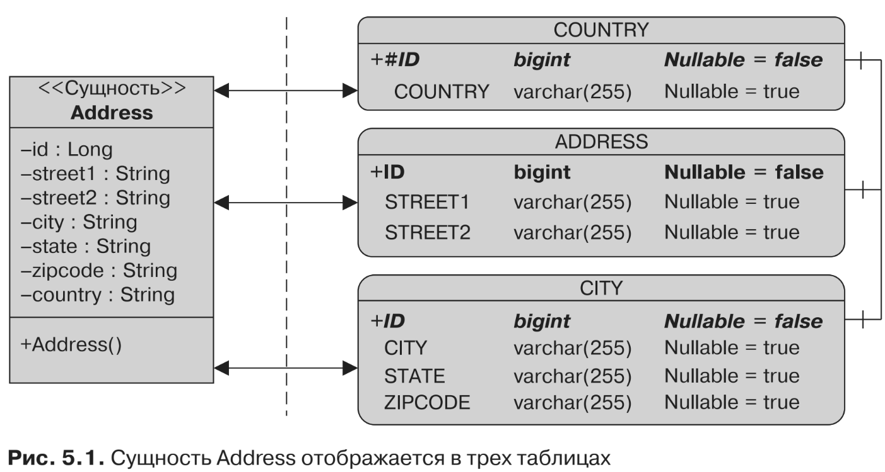

#@SecondaryTable
До сих пор я исходил из того, что сущность будет отображаться в одну таблицу,
также известную как первичная таблица. Но если у вас есть уже существующая
модель данных, необходимо разбросать данные по нескольким таблицам, или вто-
ричным таблицам. Для этого вам потребуется прибегнуть к аннотации 
* @SecondaryTable,

чтобы ассоциировать вторичную таблицу с сущностью, или 
* @SecondaryTables

(с буквой s на конце) в случае с несколькими вторичными таблицами. Вы можете рас-
пределить данные требуемой сущности по столбцам как первичной таблицы, так
и вторичных таблиц, просто определив вторичные таблицы с использованием ан-
нотаций, а затем указав для каждого атрибута то, к какой таблице он относится
(с помощью аннотации @Column, более подробное описание которой я приведу в под-
разделе «@Column»). В листинге 5.2 показано отображение атрибутов сущности
Address в одну первичную таблицу и две вторичные таблицы.
```xml
@Entity
@SecondaryTables({
        @SecondaryTable(name = "city"),
        @SecondaryTable(name = "country")
})
public class Address {
    @Id
    private Long id;
    private String street1;
    private String street2;
    @Column(table = "city")
    private String city;
    @Column(table = "city")
    private String state;
    @Column(table = "city")
    private String zipcode;
    @Column(table = "country")
    private String country;
// Конструкторы, геттеры, сеттеры
}
```
По умолчанию атрибуты сущности Address будут отображаться в первичную та-
блицу (которая по умолчанию имеет имя сущности, поэтому называется ADDRESS).
Аннотация @SecondaryTables проинформирует вас о том, что в данном случае есть две
вторичные таблицы: CITY и COUNTRY. Затем вам потребуется указать, какой атрибут
в какой таблице будет располагаться (сиспользованием аннотации 
* @Column(table="city") или @Column(table="country")). 

На рис. 5.1 показана структура таблиц, в которых
будет отображаться сущность Address. Каждая таблица содержит разные атрибуты,
однако у всех имеется один и тот же первичный ключ (для соединения таблиц).
Опять-таки не забывайте, что Derby преобразует имена таблиц в нижнем регистре
(city) в имена таблиц в верхнем регистре (CITY).

Как вы, вероятно, уже поняли, для одной и той же сущности может быть не-
сколько аннотаций. Если вы захотите переименовать первичную таблицу, то мо-
жете добавить аннотацию @Table, как показано в листинге 5.3.
```xml
@Entity
@Table(name = "t_address")
@SecondaryTables({
        @SecondaryTable(name = "t_city"),
        @SecondaryTable(name = "t_country")
})
public class Address {
// Атрибуты, конструктор, геттеры, сеттеры
}
```
