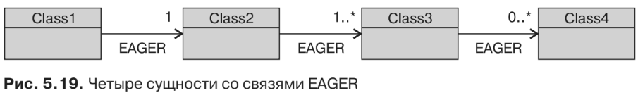
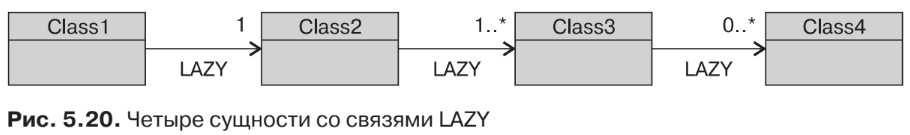
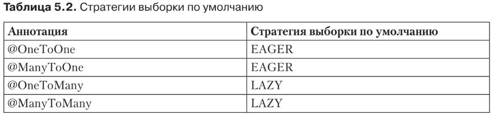

#Выборка связей
Все аннотации, которые вы видели ранее (@OneToOne, @OneToMany, @ManyToOne и@ManyToMany),
определяют атрибут выборки, указывающий, что загрузка ассоциированных объектов
должна быть незамедлительной или отложенной с результирующим влиянием на
производительность. В зависимости от вашего приложения доступ к одним связям
осуществляется чаще, чем к другим. В таких ситуациях вы можете оптимизировать
производительность, загружая информацию из базы данных, когда сущность под-
вергается первоначальному чтению (незамедлительная загрузка) или когда к ней
осуществляется доступ (отложенная загрузка). В качестве примера взглянем на не-
которые крайние случаи.

Представим себе четыре сущности, которые все связаны между собой и имеют
разные отношения («один к одному», «один ко многим»). В первом случае
(рис. 5.19) между всеми сущностями будут связи EAGER. Это означает, что, как толь-
ко вы загрузите Class1 (произведя поиск по идентификатору или выполнив запрос),
все зависимые объекты будут автоматически загружены в память. Это может от-
разиться на производительности вашей системы.


Если взять противоположный сценарий, то все связи будут задействовать
режим fetch, обеспечивающий отложенную выборку (рис. 5.20). При загрузке
Class1 ничего больше загружаться не будет (за исключением, конечно же, непо-
средственных атрибутов Class1). Вам потребуется явным образом получить доступ
к Class2 (например, с помощью метода-геттера), чтобы дать команду поставщику
постоянства на загрузку информации из базы данных и т. д. Если вы захотите
управлять всем графом объекта, то вам потребуется явным образом вызывать
каждую сущность.

Однако не следует думать, что EAGER — это плохо, а LAZY — хорошо. EAGER поместит
все данные в память с помощью небольшого количества операций доступа к базе
данных (поставщик постоянства, вероятно, будет использовать запросы с соедине-
нием для связи таблиц и извлечения данных). В случае с LAZY вы не рискуете за-
полнить всю используемую вами память, поскольку будете контролировать, какой
объект будет загружаться. Однако вам придется каждый раз осуществлять доступ
к базе данных.

Параметр fetch очень важен, поскольку, если его неправильно использовать, это
может привести к проблемам с производительностью. У каждой аннотации есть
значение fetch по умолчанию, которое вам необходимо знать, и, если оно окажется
неподходящим, изменить его (табл. 5.2).

Если при разгрузке заказа вам постоянно будет нужен доступ к его строкам
в вашем приложении, то, возможно, будет целесообразно изменить режим fetch по
умолчанию аннотации @OneToMany на EAGER (листинг 5.49).
```xml
@Entity
public class Order {
    @Id @GeneratedValue
    private Long id;
    @Temporal(TemporalType.TIMESTAMP)
    private Date creationDate;
    @OneToMany(fetch = FetchType.EAGER)
    private List<OrderLine> orderLines;
// Конструкторы, геттеры, сеттеры
}
```