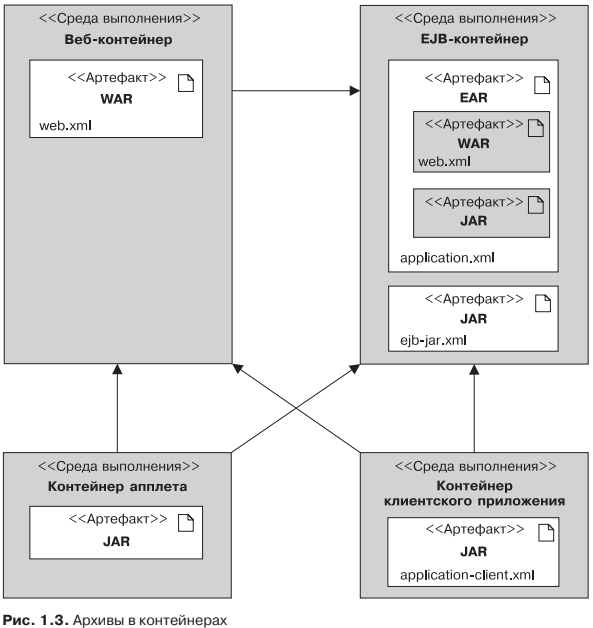

## Упаковка

* Модуль клиентских приложений содержит Java-классы и другие ресурсные
файлы, упакованные в архив JAR. Этот файл может выполняться в среде Java SE
или в контейнере клиентского приложения. Как любой другой архивный формат,
JAR-файл содержит опциональный каталог META-INF для мета-информации,
описывающей архив. Файл META-INF/MANIFEST.MF используется для определения
данных, относящихся к расширениям и упаковке. При развертывании в контей-
нере клиентских приложений соответствующий дескриптор развертывания
может быть опционально размещен по адресу META-INF/application-client.xml.

* Модуль EJB содержит один или несколько компонент-сеансов и/или компонентов,
управляемых сообщениями (MDB), упакованных в архив JAR (часто называ-
емый JAR-файл EJB). Он содержит опциональный дескриптор развертывания
META-INF/ejb-jar.xml и может развертываться только в контейнере EJB.

* Модуль веб-приложений содержит сервлеты, страницы JSP и JSF, веб-службы,
а также любые другие файлы, имеющие отношение к Сети (страницы HTML
и XHTML, каскадные таблицы стилей (CSS), Java-сценарии, изображения, видео
и т. д.). Начиная с Java EE 6 модуль веб-приложения также может содержать ком-
поненты EJB Lite (подмножество интерфейса EJBAPI, описанное в главе 7). Все
эти артефакты упаковываются в архив JAR с расширением WAR (также называ-
емый архивом WAR или веб-архивом). Опциональный веб-дескриптор разверты-
вания определяется вфайле WEB-INF/web.xml. Если архив WAR содержит компонен-
ты EJB Lite, то файл WEB-INF/ejb-jar.xml может быть снабжен опциональным
дескриптором развертывания. Java-файлы с расширением .class помещаются в ка-
талог WEB-INF/classes, а зависимые архивные JAR-файлы — в каталог WEB-INF/lib.

* Корпоративный модуль может содержать нуль или более модулей веб-приложений,
модулей EJB, а также других общих или внешних библиотек. Они упаковывают-
ся в корпоративный архив (файл JAR с расширением .ear) таким образом, чтобы
развертывание всех этих модулей происходило одновременно и согласованно.
Опциональный дескриптор развертывания корпоративного модуля определяет-
ся в файле META-INF/application.xml. Специальный каталог lib используется для
разделения общих библиотек по модулям.