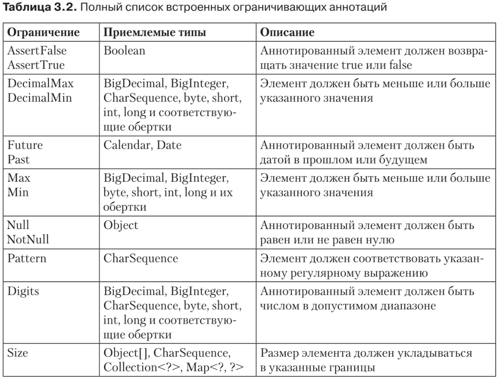

#Встроенные ограничения
Спецификация Bean Validation позволяет вам писать собственные ограничения
и валидировать их. Но в ней присутствует и несколько встроенных ограничений.
Мы уже сталкивались с некоторыми из них в предыдущих примерах, но в табл. 3.2
приведен исчерпывающий список всех встроенных ограничений (таких, которые
уже готовы для использования в коде и не требуют разработки аннотации или
класса реализации). 

Все встроенные ограничения определяются в пакете javax.validation.constraints.

##Определение собственных ограничений
Как вы уже видели, API валидации компонентов предоставляет стандартные встро-
енные ограничения, но они вполне могут не удовлетворить всех нужд вашего при-
ложения. Существует несколько способов создания собственных ограничений (от
агрегирования уже имеющихся до написания нового ограничения с нуля). Есть
разные стили выполнения такой работы (например, создание обобщенных ограни-
чений или ограничений, действующих на уровне класса).
###Объединение ограничений
* Удобный способ создания новых ограничений — агрегирование (объединение) уже
имеющихся. В таком случае мы обходимся без класса реализации. Это совсем не
сложно сделать, если имеющиеся ограничения обладают @Target(ElementType.AN-
NOTATION_TYPE), то есть при работе с ними одна аннотация может быть применена
к другой. Такой подход называется «объединением ограничений» и позволяет
создавать высокоуровневые ограничения.
* В листинге 3.5 показано, как создать ограничение Email, обходясь лишь встро-
енными ограничениями из API валидации компонентов. Это ограничение гаран-
тирует, что адрес электронной почты является ненулевым (@NotNull), состоит не
менее чем из семи символов (@Size(min = 7)) и соответствует сложному регуляр-
ному выражению (@Pattern). В таком объединенном ограничении также должны
определяться атрибуты message, groups и payload. Обратите внимание: класс реали-
зации здесь отсутствует (validatedBy = {}).
```xml
@NotNull
@Size(min = 7)
@Pattern(regexp = "[a-z0-9!#$%&'*+/=?^_`{|}~-]+
(?:\\.[a-z0-9!#$%&'*+/=?^_`{|}~-]+)*"
        + "@(?:[a-z0-9](?:[a-z0-9-]*[a-z0-9])?\\.)+[a-z0-9](?:[a-z0-9-]*
        [a-z0-9])?")
@Constraint(validatedBy = {})
@Target({METHOD, FIELD, ANNOTATION_TYPE, CONSTRUCTOR, PARAMETER})
@Retention(RetentionPolicy.RUNTIME)
public @interface Email {
    String message() default "Неверный электронный адрес";
    Class<?>[] groups() default {};
    Class<? extends Payload>[] payload() default {};
}
```
* Все встроенные ограничения (@NotNull, @Size и @Pattern) уже имеют собственные
сообщения об ошибках (элемент message()). Таким образом, если у вас окажется
нулевой адрес электронной почты, то по результатам валидации ограничение, при-
веденное в листинге 3.5, выдаст сообщение об ошибке @NotNull, а не то, что вы
определили (Неверный электронный адрес). Возможно, вы захотите использовать
для всех ограничений Email одно общее сообщение об ошибке, а не несколько раз-
ных. Для этого можно добавить аннотацию @ReportAsSingleViolation (как будет
показано ниже, в листинге 3.24). Если вы так поступите, то валидация составного
ограничения прекратится после невыполнения первого же из входящих в него
ограничений и будет выдано сообщение об ошибке, соответствующее именно тому
ограничению, которое оказалось невыполненным.
* Объединение ограничений полезно, так как подобная практика помогает из-
бежать дублирования кода и способствует переиспользованию сравнительно про-
стых ограничений. В таком случае вы будете скорее создавать простые ограничения,
чем составлять из них более сложные валидационные правила.
###Обобщенное ограничение
* Объединение простых ограничений — полезная практика, но, как правило, только
ею не обойтись. Часто приходится применять сложные валидационные алгоритмы:
проверять значение в базе данных, делегировать определенную валидационную
работу вспомогательным классам и т. д. Именно в таких случаях приходится до-
бавлять к вашей ограничивающей аннотации класс реализации.
* В листинге 3.6 показан объект POJO, представляющий сетевое соединение
с сервером, на котором находятся элементы CD-BookStore. Этот POJO имеет
несколько атрибутов типа String, все они представляют URL. Вы хотите, чтобы
URL имел допустимый формат, и даже задаете конкретный протокол (например,
http, ftp...), хост и/или номер порта. Пользовательское ограничение @URL гаран-
тирует, что разные строковые атрибуты класса ItemServerConnection соответству-
ют формату URL. Например, атрибут resourceURL может представлять собой
любой допустимый URL (в частности, file://www.cdbookstore.com/item/123). С дру-
гой стороны, вы хотите ограничить атрибут itemURL так, чтобы он работал только
с http-протоколом и с хостом, имя которого начинается с www.cdbookstore.com
(например, http://www.cdbookstore.com/book/h2g2).
```xml
public class ItemServerConnection {
    @URL
    private String resourceURL;
    @NotNull @URL(protocol = "http", host = "www.cdbookstore.com")
    private String itemURL;
    @URL(protocol = "ftp", port = 21)
    private String ftpServerURL;
    private Date lastConnectionDate;
// Конструкторы, геттеры, сеттеры
}
```
Если мы хотим создать такое пользовательское ограничение для работы
с URL, то первым делом должны определить аннотацию. В листинге 3.7 пока-
зана аннотация, выполняющая все предпосылки для валидации компонентов
(метааннотация @Constraint, атрибуты message, groups и payload). Кроме того, она
добавляет и специфические атрибуты: protocol, host и port, которые отобража-
ются на имена элементов аннотации (например, @URL(protocol = "http")). Огра-
ничение может использовать любой атрибут любого типа данных. Обратите
также внимание, что у этих атрибутов есть значения, задаваемые по умолча-
нию, — например, пустая строка для протокола или хоста или –1 для номера
порта.
```xml
@Constraint(validatedBy = {URLValidator.class})
@Target({METHOD, FIELD, ANNOTATION_TYPE, CONSTRUCTOR, PARAMETER})
@Retention(RUNTIME)
public @interface URL {
    String message() default "Malformed URL";
    Class<?>[] groups() default {};
    Class<? extends Payload>[] payload() default {};
    String protocol() default "";
    String host() default "";
    int port() default -1;
}
```
* В листинге 3.7 мы могли бы агрегировать уже имеющиеся ограничения, например
@NotNull. Но основное различие между объединением ограничений и созданием
обобщенного ограничения заключается в применении класса реализации, объяв-
ляемого в атрибуте validatedBy (здесь он ссылается на класс URLValidator.class).
* В листинге 3.8 показан класс реализации URLValidator. Как видите, он реализует
интерфейс ConstraintValidator и, следовательно, методы initialize и isValid. Здесь
важно отметить, что класс URLValidator имеет три атрибута, определенные в аннота-
ции (protocol, host и port), и инициализирует их в методе initialize(URL url). Этот
метод вызывается на этапе инстанцирования валидатора. В качестве параметра он
получает ограничивающую аннотацию (здесь URL), поэтому может извлекать значе-
ния и использовать их при валидации. Так можно поступить с атрибутом itemURL
protocol, который в листинге 3.6 имеет строковое значение "http".
```xml
public class URLValidator implements ConstraintValidator<URL, String> {
    private String protocol;
    private String host;
    private int port;
    public void initialize(URL url) {
        this.protocol = url.protocol();
        this.host = url.host();
        this.port = url.port();
    }
    public boolean isValid(String value, ConstraintValidatorContext context) {
        if (value == null || value.length() == 0) {
            return true;
        }
        java.net.URL url;
        try {
// Преобразуем URL в java.net.URL для проверки того,
// имеет ли URL допустимый формат
            url = new java.net.URL(value);
        } catch (MalformedURLException e) {
            return false;
        }
// Проверяет, имеет ли атрибут протокола допустимое значение
        if (protocol != null && protocol.length() > 0 &&
                !url.getProtocol().equals(protocol)) {
            return false;
        }
        if (host != null && host.length() > 0 && !url.getHost().startsWith(host)) {
            return false;
        }
        if (port != -1 && url.getPort() != port) {
            return false;
        }
        return true;
    }
}
```
* Метод isValid реализует алгоритм валидации URL, показанный в листинге 3.8.
Параметр value содержит значение объекта, который требуется валидировать (на-
пример, file://www.cdbookstore.com/item/123). Параметр context инкапсулирует
информацию о контексте, в котором осуществляется валидация (подробнее об этом
ниже). Возвращаемое значение является логическим и указывает, успешно ли про-
шла валидация.
* Основная задача валидационного алгоритма в листинге 3.8 — привести пере-
данное значение к java.net.URL и проверить, правильно ли оформлен URL. После
этого алгоритм также проверяет валидность атрибутов protocol, host и port. Если
хотя бы один из них окажется невалидным, то метод вернет false. Как будет пока-
зано далее в разделе «Валидация ограничений», поставщик валидации компонентов
задействует это логическое значение при создании списка ConstraintViolation.
* Обратите внимание: метод isValid расценивает нуль как валидное значение (if
(value == null ... return true)). Спецификация Bean Validation считает такую
практику рекомендуемой. Так удается не дублировать код ограничения @NotNull.
Пришлось бы одновременно использовать ограничения @URL и @NotNull, чтобы ука-
зать, что вы хотите представить валидный ненулевой URL (такой как атрибут
itemURL в листинге 3.6).
* Сигнатура класса определяет тип данных, с которым ассоциируется ограни-
чение. В листинге 3.8 URLValidator реализован для типа String (Constraint-
Validator<URL, String>). Это означает, что если вы примените ограничение @URL
к другому типу (например, к атрибуту lastConnectionDate), то получите при
валидации исключение javax.validation.UnexpectedTypeException, так как не будет
найден подходящий валидатор для типа java.util.Date. Если вам требуется
ограничение, которое будет применяться сразу к нескольким типам данных, то
необходимо либо использовать суперклассы, когда это возможно (скажем, мож-
но было бы определить URLValidator для CharSequence, а не для строки, выразив
его так: ConstraintValidator<URL, CharSequence>), либо применить несколько
классов реализации (по одному для String, CharBuffer, StringBuffer, StringBuilder)
в случае иного валидационного алгоритма.