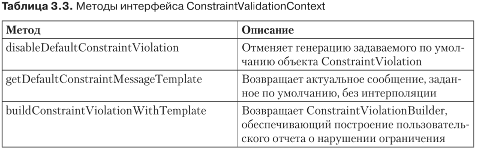

#Контекст ConstraintValidator
Итак, мы убедились, что классы реализации ограничений должны реализовывать
ConstraintValidator и, следовательно, определять собственный метод isValid. Сиг-
натура метода isValid принимает тип данных, к которому применяется ограничение,
а также ConstraintValidationContext. Этот интерфейс инкапсулирует данные, от-
носящиеся к тому контексту, в котором поставщик выполняет валидацию компо-
нентов. В табл. 3.3 перечислены методы, определяемые в интерфейсе 
javax.validation.ConstraintValidatorContext.

Интерфейс ConstraintValidatorContext позволяет повторно определить за-
данное по умолчанию сообщение, связанное с ограничением. Метод build-
ConstraintViolationWithTemplate возвращает ConstraintViolationBuilder, опираясь
на гибкий образец API, позволяющий создавать пользовательские отчеты о на-
рушениях. Следующий код добавляет к отчету информацию о новом нарушении
ограничения:
```xml
context.buildConstraintViolationWithTemplate("Invalid protocol")
.addConstraintViolation();
```
* Такая техника позволяет генерировать и создавать одно или несколько пользо-
вательских сообщений-отчетов. Если рассмотреть пример с ограничением @URL из
листинга 3.7, то мы увидим, что всему ограничению здесь соответствует лишь одно
сообщение об ошибке (Malformed URL). Но у этого ограничения несколько атри-
бутов (protocol, host и port), и нам могут понадобиться специфичные сообщения
для каждого из этих атрибутов, например: Invalid protocol (Недопустимый про-
токол) или Invalid host (Недопустимый хост).
* В листинге 3.17 мы вновь рассмотрим класс реализации ограничения URL и вос-
пользуемся ConstraintValidatorContext, чтобы изменить сообщение об ошибке. Код
полностью отключает генерацию заданного по умолчанию сообщения об ошибке
(disableDefaultConstraintViolation) и отдельно определяет сообщения об ошибках
для каждого атрибута.
```xml
public class URLValidator implements ConstraintValidator<URL, String> {
    private String protocol;
    private String host;
    private int port;
    public void initialize(URL url) {
        this.protocol = url.protocol();
        this.host = url.host();
        this.port = url.port();
    }
    public boolean isValid(String value, ConstraintValidatorContext context) {
        if (value == null || value.length() == 0) {
            return true;
        }
        java.net.URL url;
        try {
            url = new java.net.URL(value);
        } catch (MalformedURLException e) {
            return false;
        }
        if (protocol != null && protocol.length() > 0 &&
                !url.getProtocol().equals(protocol)) {
            context.disableDefaultConstraintViolation();
            context.buildConstraintViolationWithTemplate("Неверный
                    протокол").addConstraintViolation();
            return false;
        }
        if (host != null && host.length() > 0 && !url.getHost().startsWith(host)) {
            context.disableDefaultConstraintViolation();
            context.buildConstraintViolationWithTemplate("Неверный
                    хост").addConstraintViolation();
            return false;
        }
        if (port != -1 && url.getPort() != port) {
            context.disableDefaultConstraintViolation();
            context.buildConstraintViolationWithTemplate("Неверный
                    порт").addConstraintViolation();
            return false;

            Написание ограничений 119

        }
        return true;
    }
}
```