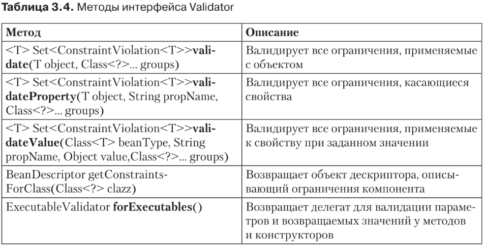
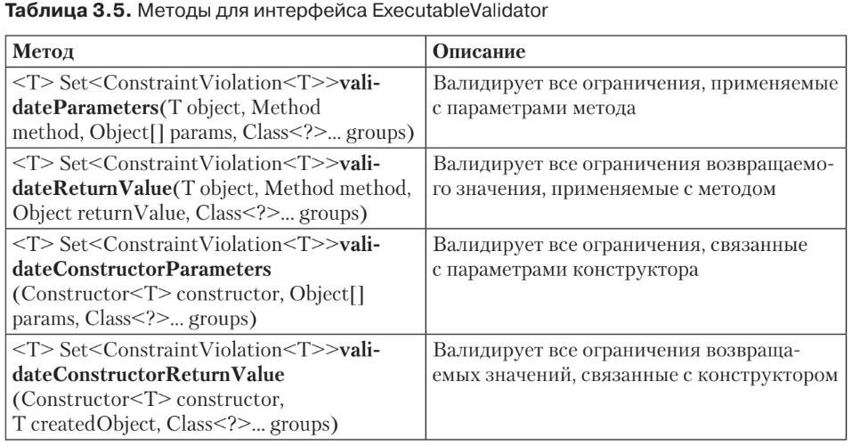
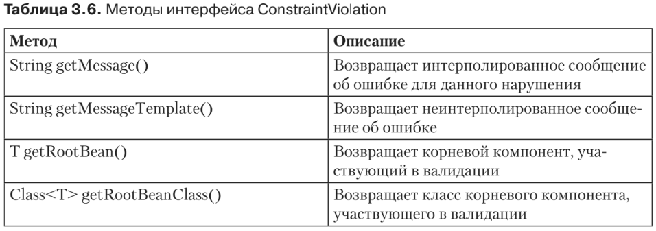
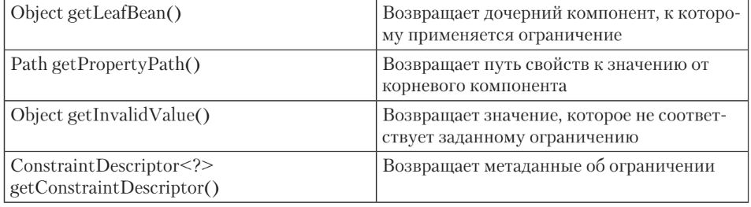

#Валидация ограничений
* До сих пор мы плотно работали с ограничениями — определяли их, агрегировали,
реализовывали наши собственные, настраивали сообщения об ошибках, возились
с группами. Но без специальной валидационной среды исполнения проверка огра-
ничений невозможна. Как и с большинством технологий Java EE 7, код в данном
случае должен работать внутри контейнера или управляться поставщиком.
* Ограничения можно применять к компонентам, атрибутам, геттерам, конструк-
торам, параметрам методов и возвращаемым значениям. Итак, валидация может
выполняться для элементов всех этих типов. Можно валидировать компоненты,
свойства, значения, методы и группы, а также задавать собственные ограничения
для графа объектов. Чтобы все эти ограничения проверялись во время исполнения,
вам потребуется валидационный API.
##Валидационные API
Среда исполнения валидации использует небольшой набор API, которые позволя-
ют ей проверять ограничения. Основной API — это интерфейс 

javax.validation.Validator. 

Он содержит соглашения для валидации объектов и графов объектов неза-
висимо от уровня, на котором этот интерфейс реализован (уровень представления,
уровень бизнес-логики или бизнес-модели). При ошибке валидации возвращается
набор интерфейсов 

javax.validation.ConstraintViolation. 

Он предоставляет контекст произошедшего нарушения, а также сообщение, описывающее нарушение.
###Валидатор
Основной входной точкой для валидации является интерфейс 

Validator. 

Этот API позволяет проверять экземпляры компонентов, обходясь немногочисленными
методами, перечисленными в табл. 3.4. Все эти методы объявляют каждое новое
ограничение по одному и тому же образцу.
* Устанавливается подходящая реализация ConstraintValidator, которая будет
использоваться при определении данного ограничения (например, определяет-
ся ConstraintValidator для ограничения @Size, применяемого со строкой).
* Выполняется метод isValid.
* Если isValid возвращает true, программа переходит к следующему ограничению.
* Если isValid возвращает false, поставщик валидации компонентов добавляет 
ConstraintViolation в список нарушений ограничений.


Если в ходе этой процедуры валидации происходит какая-либо неисправимая
ошибка, то выдается исключение ValidationException. Это исключение может быть
специализированным и может указывать на конкретные ситуации (недопустимое
определение группы, недопустимое определение ограничения, недопустимое объ-
явление ограничения).

Методы validate, validateProperty и validateValue используются соответственно
для валидации целого компонента, свойства или свойства при заданном значении.
Все методы принимают параметр varargs, позволяющий указывать группы для
валидации. Метод forExecutables предоставляет доступ к ExecutableValidator для
валидации методов, параметров конструктора и валидации возвращаемого значе-
ния. В табл. 3.5 описан API ExecutableValidator.

###ConstraintViolation

Все валидационные методы, перечисленные в табл. 3.4 и 3.5, возвращают множество
ConstraintViolation, которое можно перебирать и при этом просматривать, какие
ошибки возникли при валидации. Если это множество пустое — значит, валидация
прошла успешно. При ошибках в это множество добавляется по экземпляру
ConstraintViolation для каждого нарушенного ограничения. ConstraintViolation
описывает единую ошибку, связанную с ограничением, а его API дает множество
полезной информации о причине ошибки. В табл. 3.6 сделан обзор этого API.


###Получение валидатора
* Первый этап валидации компонента — приобрести экземпляр интерфейса Validator.
Как и в большинстве спецификаций Java EE, вы можете либо получить Validator
программно (если ваш код выполняется вне контейнера), либо внедрить его (если
код выполняется в EJB- или веб-контейнере).
* Если вы делаете это программно, то необходимо начать с класса Validation,
осуществляющего начальную загрузку поставщика валидации компонентов. Его
метод buildDefaultValidatorFactory строит и возвращает фабрику ValidatorFactory,
которая, в свою очередь, используется для построения Validator. Код выглядит
следующим образом:
```xml
ValidatorFactory factory = Validation.buildDefaultValidatorFactory();
Validator validator = factory.getValidator();
```
Затем вам придется управлять жизненным циклом ValidatorFactory и программ-
но закрывать его:
```xml
factory.close();
```
Если ваше приложение работает в контейнере Java EE, то контейнер должен
предоставлять через JNDI следующие экземпляры:
```xml
ValidatorFactory под java:comp/ValidatorFactory;
Validator под java:comp/Validator.
```
Затем вы можете искать эти JNDI-имена и получать экземпляры Validator.
Но вместо поиска экземпляров через JNDI вы можете запросить, чтобы они были
внедрены с помощью аннотации @Resource:
```xml
@Resource ValidatorFactory validatorFactory;
@Resource Validator validator;
```
Если ваш контейнер использует CDI (а это происходит в Java EE 7 по умолча-
нию), то он должен допускать внедрение с помощью @Inject:
```xml
@Inject ValidatorFactory;
@Inject Validator;
```
В любом случае (как с @Resource, так и с @Inject) контейнер следит за жизненным
циклом фабрики. Поэтому вам не придется вручную создавать или закрывать
ValidatorFactory.