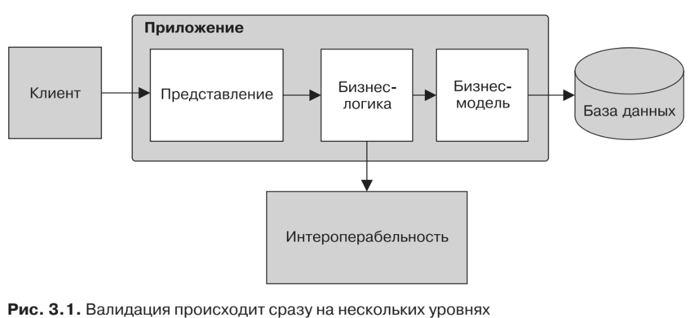
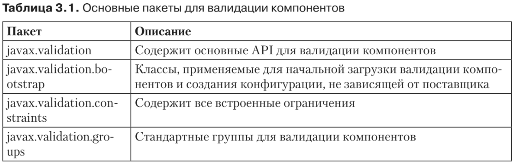
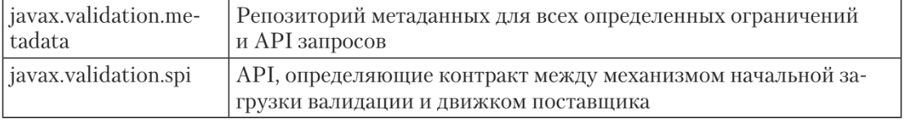

#Валидация компонентов
* Валидация компонентов решает проблему дублирования кода и излишнего запу-
тывания классов предметной модели. Разработчику достаточно написать ограничение
всего один раз, использовать его и валидировать на любом уровне. Валидация компо-
нентов позволяет реализовать ограничение в обычном коде Java, а потом определить
его спомощью аннотации (метаданных). Затем вы можете использовать эту аннотацию
в своем компоненте, свойствах, конструкторах, параметрах методов и с возвращаемым
значением. Валидация компонентов предоставляет простой API, позволяющий раз-
работчикам писать и переиспользовать ограничения, связанные с бизнес-логикой.

##Понятие об ограничениях и валидации
* Большую часть рабочего времени программист тратит на то, чтобы гарантировать
валидность (пригодность) тех данных, которые обрабатываются и сохраняются
в приложении. Разработчик пишет ограничения для допустимых значений данных,
применяет эти ограничения к логике имодели приложения, а также гарантирует, что
на различных уровнях валидация этих ограничительных условий происходит со-
гласованно. Таким образом, эти ограничения должны применяться в клиентском
приложении (например, в браузере, если речь идет о разработке веб-приложения),
на уровне представления, бизнес-логики, бизнес-модели (она же — предметная мо-
дель), в схеме базы данных и в определенной степени на уровне интероперабельности
(рис. 3.1). Разумеется, для обеспечения согласованности необходимо синхронизи-
ровать эти правила на всех используемых уровнях и в применяемых технологиях.

##Приложение
* Валидация на уровне приложения, обеспечивающая правильность введенных
данных, может проводиться в разных местах.
    * Уровень представления. На этом уровне данные валидируются потому, что вы
можете получать их от разных клиентов (браузер; инструмент для работы с ко-
мандной строкой, например c URL, позволяющий отправлять команды по про-
токолу HTTP; нативное приложение). На этом же уровне вы стараетесь обе-
спечить быструю обратную связь с пользователем.
    * Уровень бизнес-логики. Здесь координируются вызовы, направляемые к внутренним
и внешним службам, к предметной модели, и так обеспечивается валидность
обрабатываемых данных.
    * Уровень бизнес-модели. Данный уровень обычно обеспечивает отображение
предметной модели на базу данных, поэтому здесь валидация должна проис-
ходить до сохранения данных.
* В сложном приложении зачастую приходится многократно реализовывать одно
и то же ограничение сразу на нескольких уровнях, из-за чего значительная часть
кода дублируется.
##База данных
* В конце концов, основная цель — хранить в вашей базе данных только валидную ин-
формацию, чтобы обработку можно было выполнить позднее. Строгие ограничения
должны соблюдаться в реляционных базах данных, потому что здесь применяются
схемы. Язык определения данных (DDL, также называемый языком описания данных)
использует специальный синтаксис для определения и ограничения структур, входя-
щих в состав базы данных. После этого вы сможете гарантировать, что данные в столб-
це не могут быть равны нулю (NOT NULL), должны быть целочисленными (INTEGER) или
иметь ограничение максимальной длины (VARCHAR(20)). В последнем примере попытка
вставить в столбец строку длиной 20 символов окончится неудачей.
* Тем не менее выполнение валидации на уровне базы данных связано с некоторыми
недостатками: негативное влияние на производительность, сообщения об ошибках
выдаются вне контекста. Неверные данные должны пересечь все уровни приложения,
прежде чем будут отправлены на удаленный сервер базы данных, который затем об-
работает валидацию и отправит обратно сообщение об ошибке. Ограничения, при-
меняемые на уровне базы данных, учитывают только фактические данные, но не
действия, осуществляемые пользователем. Поэтому сообщения об ошибках выдаются
вне контекста и не могут точно описывать ситуацию. Именно по этой причине нужно
стараться валидировать данные раньше — в приложении или еще на клиенте.
##Клиент
* Валидация данных на стороне клиента очень важна: так пользователь сможет опе-
ративно узнавать о том, что при вводе данных он допустил ошибку. Такая валида-
ция сокращает количество избыточных обращений к серверу, практика использо-
вания также улучшается, поскольку многие ошибки отлавливаются на раннем
этапе. Эта возможность особенно важна при разработке мобильных приложений,
которые обычно должны обходиться очень узкой полосой доступа к сети.
##Интероперабельность
* Зачастую корпоративные приложения должны обмениваться данными с внешни-
ми партнерами/системами. Такие приложения, относящиеся к категории «бизнес
для бизнеса», получают информацию в любом формате, обрабатывают их, сохра-
няют и отправляют обратно партнеру. Валидация пользовательских (заказных)
форматов — порой сложная и затратная задача.
    * База данных -> DDL
    * XML -> XSD
    

##Справочная реализация
* Hibernate Validator — это свободная справочная реализация валидации компонен-
тов. Проект изначально был запущен в 2005 году компанией JBoss в рамках Hibernate
Annotations, стал независимым в 2007 году, а статус справочной реализации при-
обрел в 2009 году (с выходом Hibernate Validator 4). В настоящее время Hibernate
Validator 5 реализует валидацию компонентов (версия 1.1) и добавляет кое-какие
собственные возможности, в числе которых политика быстрого отказа. В соответ-
ствии с этим принципом программа прерывает текущую валидацию и возвращает-
ся после первого же нарушения ограничивающих условий. К другим характерным
особенностям этой реализации относится API для программного конфигурирова-
ния ограничений, а также дополнительные встроенные ограничения.
* На момент написания этой книги Hibernate Validator 5 был единственной реа-
лизацией, совместимой с Bean Validation 1.1. В Apache BVal применялась специфи-
кация Bean Validation 1.0, в настоящее время идет процесс сертификации на соот-
ветствие версии 1.1. Oval не реализует полную спецификацию Bean Validation, но
умеет обрабатывать связанные с ней ограничения.